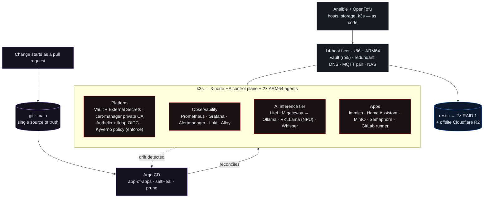

# HomeLab — GitOps platform on a 14-host x86 + ARM64 fleet

A production-style platform run at home: a **3-node HA k3s cluster**, everything in it
reconciled by **Argo CD** from this repo, hosts built by **Ansible** and **OpenTofu**,
secrets from **HashiCorp Vault**, policy enforced by **Kyverno**, and a full
**Prometheus / Grafana / Loki** observability stack. An ARM64 tier serves local AI
inference on NPUs behind an OpenAI-compatible gateway. Backups go to two RAID 1 mirrors
and offsite to Cloudflare R2, and **restores are drilled, not assumed**.

**Cloud counterpart:** [HomeLab-aws](https://github.com/swares/HomeLab-aws) builds an
EKS cluster from nothing, runs a slice of the same stack (Argo CD, Kyverno, LiteLLM) with
IRSA and an ALB, and destroys it every night for about $1 a session. It is deliberately
detachable: nothing in this repo depends on it.



## What this demonstrates

| Skill | Where to look |
|---|---|
| **GitOps end to end.** Every change is a PR. Argo CD app-of-apps plus a git-directory ApplicationSet, `selfHeal` and `prune` on, rollback is `git revert` | `gitops/`, `docs/UPDATES.md` |
| **CI guardrails before merge.** YAML lint, kubeconform schema validation, ApplicationSet collision checks, and OPA/conftest policies run on every PR | `.github/workflows/validate.yml`, `ci/policies/` |
| **Policy as code in the cluster.** Kyverno in Enforce mode: no `:latest`, no privileged pods, resource limits required | `gitops/workloads/kyverno/` |
| **Secrets management.** Vault (KV v2, policies in git, no standing root token) feeding External Secrets Operator; Ansible Vault for host secrets | `ansible/files/vault-policies/`, `docs/SECURITY.md` |
| **Identity.** Authelia OIDC single sign-on backed by lldap; cert-manager private CA for TLS | `docs/SSO.md` |
| **Observability.** kube-prometheus-stack, Loki, Alloy on every node, blackbox probes, Alertmanager | `gitops/apps/monitoring.yaml`, `gitops/workloads/monitoring/` |
| **Infrastructure as code.** Ansible for 14 hosts across x86 and ARM64, OpenTofu with remote state, Packer images, nightly drift checks, Renovate dependency PRs | `ansible/`, `tofu/`, `packer/`, `renovate.json` |
| **Backup and disaster recovery.** restic to two local mirrors and offsite R2, etcd and Vault snapshots, and restore drills that actually restored data | `docs/BACKUP-RESTORE.md` |
| **Incident response.** A written incident record with root cause, fix, and proof by unattended reboot | `docs/INCIDENT-2026-08-23-h4-boot.md` |
| **AI platform engineering.** LiteLLM gateway routing to Ollama, NPU-native RKLLama, and Whisper, plus an adapter that makes edge devices an inference backend | `docs/AI-INFERENCE.md`, `docs/AI-ROUTING.md` |

## Why it's shaped this way

- **k3s, not full Kubernetes** — the H4 is also the NAS. k3s runs as a single systemd
  service alongside the NFS server and leaves most of the box free. Traefik is the default
  ingress; workloads use `networking.k8s.io/v1 Ingress`, not OpenShift Routes.
- **Argo CD, not imperative ops** — change the cluster by editing git and opening PRs.
  Argo reconciles with `selfHeal` on, so drift reverts and rollback is `git revert`.
  Never `kubectl apply` to `main` directly.
- **Two cold tiers** — a fast 4 TB NVMe for etcd/PVs/live NAS (OS on the 256 GB eMMC),
  and two SATA RAID 1 mirrors (8 TB primary + ~5.45 TB secondary) for backups and cold
  storage. See [docs/ARCHITECTURE.md](docs/ARCHITECTURE.md).

## Repo map

| Path | What it is |
|------|------------|
| `ansible/` | Host provisioning: storage, k3s install, backups, Argo bootstrap, password rotation |
| `gitops/` | What Argo deploys — `bootstrap/` (app-of-apps), `apps/`, `workloads/` |
| `docs/` | Architecture, hardware, runbook, security, AI inference, service catalog, updates |
| `scripts/` | One-shot helpers (`enable-winrm.ps1`, `lab-check.sh`, flannel FDB service) |
| `ci/` | OPA/conftest policies run by CI against every workload manifest |
| `tofu/`, `packer/` | OpenTofu (VMs, DNS) and Packer image builds |
| `archive/` | Superseded files kept for reference; nothing here is live |
| `CLAUDE.md` | Operating rules — read before touching anything |

## What's running

### Cluster workloads (managed by Argo CD)

| App | Namespace | Notes |
|-----|-----------|-------|
| Immich | `immich` | Photo server + Postgres (vectorchord) + Redis + ML; library on NFS ReadWriteMany PV |
| LiteLLM gateway | `ai-gateway` | Unified OpenAI-compatible API (`ai.apps.lab.home.arpa`) across all backends |
| RKLLama | `ai-gateway` | NPU-native LLM on opi5pro-1/2 (DeepSeek-R1-Distill-Qwen-1.5B, ~7–8 tok/s) |
| Ollama | `ai-gateway` | In-cluster fallback engine on opi5pro-1/2; pinned to `ollama/ollama:0.32.0` |
| m5stack-adapter | `ai-gateway` | OpenAI shim for M5Stack `/api/*` protocol; image 0.1.1 |
| Whisper STT | `whisper` | Speech-to-text at `https://stt.apps.lab.home.arpa`; CPU on n150-1 |
| lldap | `lldap` | Lightweight LDAP directory; web UI at `lldap.apps.lab.home.arpa` |
| Authelia | `authelia` | OIDC/SSO backed by lldap; PostgreSQL backend; `authelia.apps.lab.home.arpa` |
| Home Assistant | `home-assistant` | `ha.apps.lab.home.arpa`; MQTT consumer (broker at opi-zero2w-2 .188) |
| Minio | `minio` | S3-compatible object store; `tofu-state` bucket holds OpenTofu state |
| Semaphore | `semaphore` | Ansible UI at `semaphore.apps.lab.home.arpa` |
| Kyverno | `kyverno` | 3 ClusterPolicies in Enforce mode (no-latest-tag, resource-limits, no-privileged) |
| kube-prometheus-stack | `monitoring` | Prometheus (30d/40GB), Grafana, Alertmanager, Loki, Alloy on all nodes |
| external-secrets | `external-secrets` | Pulls secrets from Vault (KV v2 at `secret/lab/`) |
| cert-manager | `cert-manager` | TLS via `lab-ca` ClusterIssuer (self-signed root CA) |
| Argo CD | `argocd` | GitOps controller — selfHeal + prune on all apps |

### Host services, endpoints and fleet

Outside the cluster, the fleet runs HashiCorp Vault (Raspberry Pi 5), redundant Pi-hole
DNS with a dnsmasq fallback, an HA Mosquitto MQTT pair, the NFS server on the H4, and GitLab
CE in a KVM VM. Every service is exposed at `*.apps.lab.home.arpa` through a kube-vip
VIP in front of Traefik.

| Host class | Count | Role |
|---|---|---|
| Odroid-H4 Ultra (x86) | 1 | k3s server + NAS |
| N150 mini PC (x86) | 3 | two k3s servers + KVM hypervisors, one Windows host (WinRM) |
| Orange Pi 5 Pro (ARM64, RK3588 NPU) | 2 | k3s agents, LLM inference |
| Raspberry Pi 5 / 4B / 3B | 3 | Vault, primary and secondary DNS |
| Orange Pi Zero 2W | 4 | MQTT pair, fallback DNS |
| Odroid XU3 | 1 | Legacy board on Ubuntu 16.04; retire or rebuild pending (`BACKLOG.md` §2.16) |

Full detail lives in one place each, so it can't drift between copies:
[docs/HARDWARE.md](docs/HARDWARE.md) owns hosts and IPs,
[docs/services.md](docs/services.md) owns the service catalog and endpoints.

## Quickstart (fresh bootstrap)

> Full step-by-step is in [docs/RUNBOOK.md](docs/RUNBOOK.md).

1. **Prereqs** — Ubuntu 22.04 on eMMC, NVMe + SATA disks ready, SSH key access, DNS
   records for `api.lab.home.arpa` → 192.168.1.200 and `*.apps.lab.home.arpa` → 192.168.1.201.
2. **Set your repo URL** — replace the `repoURL` in `gitops/bootstrap/root-app.yaml`.
3. **Bootstrap:**
   ```bash
   ansible-playbook -i ansible/inventory/hosts.yml ansible/playbooks/storage.yml --check
   ansible-playbook -i ansible/inventory/hosts.yml ansible/playbooks/storage.yml
   ansible-playbook -i ansible/inventory/hosts.yml ansible/playbooks/k3s.yml
   ansible-playbook -i ansible/inventory/hosts.yml ansible/playbooks/backup.yml
   ansible-playbook -i ansible/inventory/hosts.yml ansible/playbooks/argocd.yml
   ```
4. **Verify** — `kubectl get nodes`, then open `https://argocd.apps.lab.home.arpa`.

## Day-to-day operations

Add a workload: add a directory under `gitops/workloads/` and an `Application` in
`gitops/apps/`, then merge to `main`. Argo deploys it within ~30 seconds.

Change anything: edit git, never poke the cluster directly. Secrets: store in Vault under `secret/lab/<name>`, then create an `ExternalSecret` in
the workload namespace. See `gitops/workloads/immich/external-secret.yaml` for an example.

## Updates and rollback

See [docs/UPDATES.md](docs/UPDATES.md) for the full update workflow. Short version:

| Layer | Update | Rollback |
|-------|--------|----------|
| Container image | Renovate PR → merge → Argo syncs | `git revert HEAD && git push` (~60s) |
| k3s binary | `make update-k3s` after Renovate PR | Re-run with previous version |
| OS packages | `make update-vms` (drain → apt → uncordon) | Restore from backup |
| Pi-hole | `make update-pihole` (secondary first) | Re-run `pihole -up` |
| Vault | Upgrade via apt; run `make check-vault` after | Restart + unseal |
| Windows nodes | Ansible `windows-bootstrap.yml` | Manual |

## Secrets and security

- Ansible Vault: `immich_db_password`, `lab_user_password_hash`, `windows_ansible_password`
- Vault KV v2: `secret/lab/immich`, `secret/lab/grafana`, `secret/lab/argocd-deploy-key`
- SSH password auth disabled on all Linux hosts; root locked
- Vault auto-unseal via systemd service on rpi5 (keys file on-disk, `root:root 0400`)
- Never commit: `/etc/restic/password`, `ansible/.vault_pass`, any kubeconfig or k3s token

See [docs/SECURITY.md](docs/SECURITY.md) for the full security model.

## Storage rules

- **Never** `mkfs`/`wipefs` the cold disks (`/dev/md0`, `/dev/md1`)
- **Never** run `restic forget`/`prune` by hand — retention is handled by backup timers only
- **Never** stop `nfs-server`, `backup-nas`, or `backup-etcd`. There is no Samba on the H4; NFS is the only export path
- Before any hot-tier storage change: confirm last backup succeeded

## Open work

**All open work lives in [`BACKLOG.md`](BACKLOG.md).** It is the single list, swept
from every document and from the code, and ordered by what happens if an item is
ignored.

It exists because the lists drifted. An earlier TODO here claimed offsite restic backup
was done when it had never copied a byte: the unit existed, but `offsite_restic_repo` was
never set, so it exited 0 nightly and reported PASSED. It was fixed and verified on
2026-08-07 (`BACKLOG.md` §1.3). A green status over unfinished work is the failure this
repo now checks for.

The dated `TODO-2026-*.md` files that preceded `BACKLOG.md` are kept, unedited, in
[`archive/`](archive/) because `BACKLOG.md` cites them by line number.

## Related repositories

| Repo | What it is |
|---|---|
| [HomeLab-aws](https://github.com/swares/HomeLab-aws) | Ephemeral EKS sandbox: OpenTofu, IRSA, ALB controller, ordered nightly teardown |
| [My_M5Stack_Core_Framework](https://github.com/swares/My_M5Stack_Core_Framework) | Edge sensor and inference firmware; its adapter runs in this cluster |
| [HostMon](https://github.com/swares/HostMon) | ESP32-S3 network-monitoring appliance that alerts into the edge tier |
