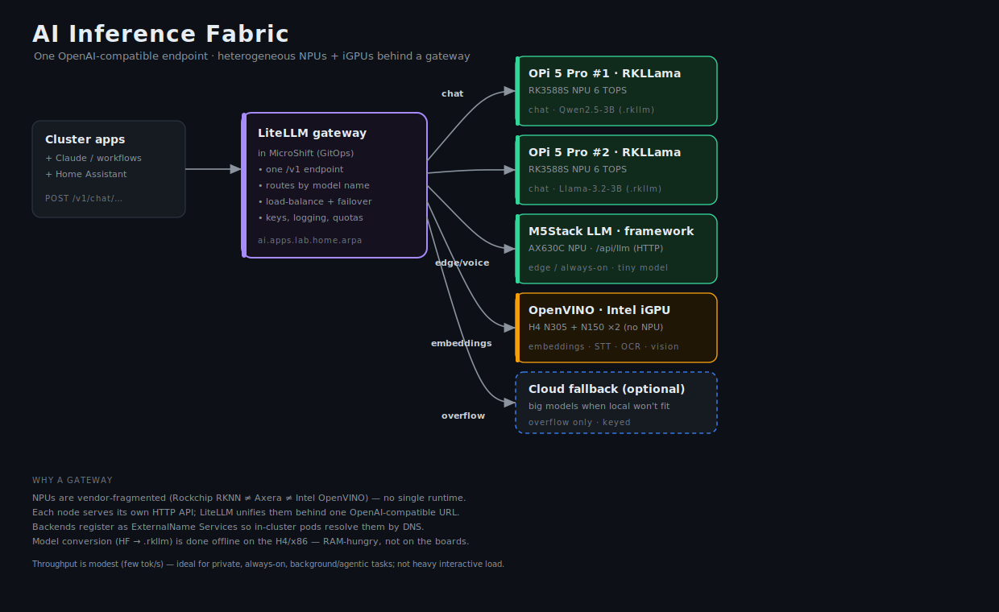
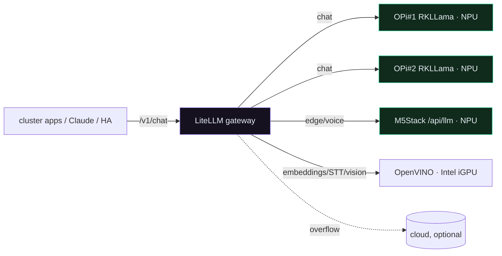
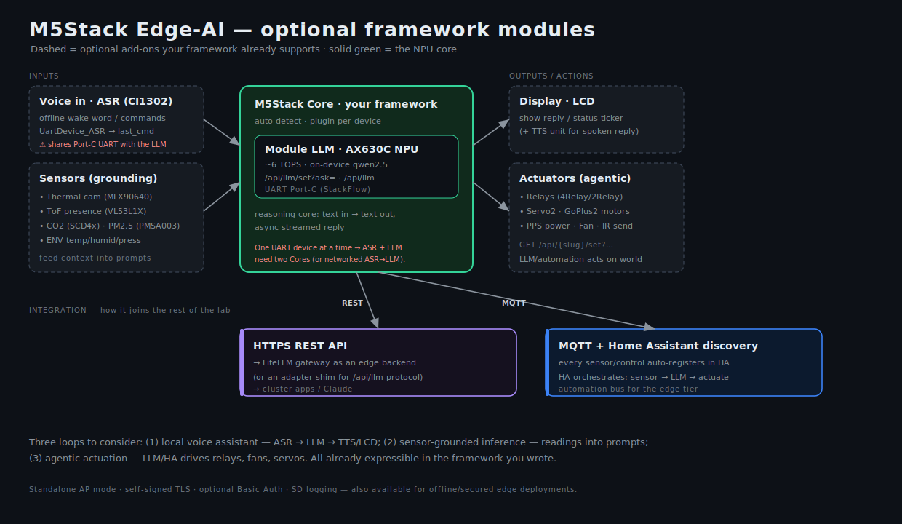
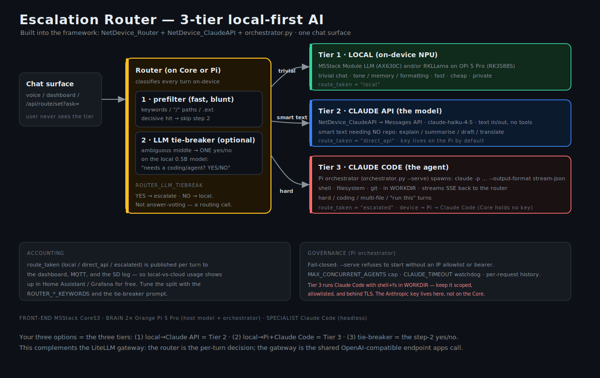

# Leveraging the NPUs (and iGPUs)

The lab has real AI silicon, but it's **heterogeneous** — three different vendors, three
different runtimes. The way to make it useful is not to unify the hardware (you can't) but to
put each accelerator behind its own HTTP inference service and unify at a **gateway**.

## What you actually have

| Accelerator | Where | Runtime | Good at |
|-------------|-------|---------|---------|
| **RK3588S NPU, 6 TOPS** ×2 | Orange Pi 5 Pro #1/#2 | Rockchip **RKLLM** (`rknn-llm`) | small LLM chat on-device |
| **AX630C NPU, ~6 TOPS** | M5Stack Module LLM | your **M5Stack framework** (`/api/llm`) | always-on edge / tiny model / voice |
| **Intel iGPU** (24–32 EU) | H4 N305, N150 ×3 | **OpenVINO** | embeddings, STT, OCR, vision (no LLM NPU) |

The Intel boxes have **no NPU** — the N150 is a Twin Lake (Alder Lake-N) part, the N305 is
Alder Lake-N too. Their iGPUs are still useful for the non-LLM work the NPUs are bad at
(embeddings, Whisper STT, OCR, image classification) via OpenVINO. Combined NPU budget is
~18 TOPS; throughput is modest (a few tokens/sec for 3B-class models), so this is a
**privacy-preserving, always-on, background/agentic** inference tier — not a heavy
interactive one.

## The pattern: serve locally, unify at a gateway

Each accelerator node runs a small model-serving daemon that exposes an HTTP API:

- **Orange Pi 5 Pro → RKLLama.** RKLLama is an Ollama-style server for the Rockchip NPU; it
  loads `.rkllm` models and serves them over HTTP. Models are converted from Hugging Face to
  `.rkllm` with the `rkllm-toolkit` (do the conversion **on the H4 or an x86 box** — it needs
  many GB of RAM/swap — never on the Pi). Pre-converted Qwen2.5/Llama-3.2-3B/Phi-3 builds
  exist on Hugging Face to start fast.
- **M5Stack → your framework.** It already exposes the AX630C over `GET /api/llm/set?ask=…`
  plus `GET /api/llm` for the streamed reply, and publishes over MQTT (Mosquitto on
  opi-zero2w-2, HA-bridged to opi-zero2w-4). That's an inference
  endpoint as-is — no extra work to stand it up.
- **Intel iGPU → OpenVINO Model Server (OVMS).** Runs embeddings/STT/vision models on the
  iGPU and recent versions expose an OpenAI-compatible API.

Then a single **LiteLLM gateway** (running in MicroShift, deployed by Argo) presents **one
OpenAI-compatible `/v1` endpoint** and routes by model name to the right backend, with
load-balancing across the two OPis, failover, key management, and logging. Apps — Claude
workflows, Home Assistant, anything — point at `ai.apps.lab.home.arpa` and never need to know
which NPU served them.

## How it plugs into the cluster

- The gateway is a normal GitOps workload: `gitops/workloads/ai-gateway/` (Deployment +
  Service + Route + a ConfigMap with the model→backend routing).
- The NPU nodes live outside the cluster, so they're registered as **ExternalName Services**
  (`gitops/workloads/ai-backends/`) — in-cluster pods then resolve `rkllama-opi1` etc. by DNS.
- The NPU runtimes themselves are **host services**, installed by Ansible
  (`ansible/playbooks/ai-nodes.yml`): RKLLama on the OPis, OVMS on the Intel boxes. They need
  vendor drivers and device access (`/dev/dri`, the RKNPU device), so bare-metal/host is the
  simplest first step; containerizing with device passthrough is a later optimization.

## Optional M5Stack framework modules worth considering

Your framework supports far more than the Module LLM, and several optional modules turn the
M5Stack from "a chat endpoint" into a self-contained **edge-AI node**. Three composable loops:

1. **Local voice assistant** — the **ASR module (CI1302)** does offline wake-word / command
   recognition (`UartDevice_ASR` → `last_cmd`); chain it into the Module LLM and surface the
   reply on the LCD (or a TTS unit). *Constraint:* ASR and the Module LLM both use the Port-C
   UART, and the framework binds **one UART device at a time per Core** — so a single-Core
   voice→LLM loop isn't possible as-is. Use **two Cores** (one ASR, one LLM) or run ASR on one
   node and forward the recognized text to the LLM over the network/MQTT.

2. **Sensor-grounded inference** — the framework already exposes a rich sensor set over REST
   and MQTT: thermal camera (MLX90640), ToF presence (VL53L1X), CO2 (SCD4x), PM2.5 (PMSA003),
   ENV temp/humidity/pressure, TVOC, and more. Feed those readings as **context into prompts**
   ("CO2 is 1400 ppm and PM2.5 is high — what should I do?"), or run lightweight vision/occupancy
   inference on the thermal/ToF streams via the OpenVINO/NPU tier.

3. **Agentic actuation** — the controllable outputs (4Relay/2Relay, Servo2, GoPlus2 motors,
   **PPS** programmable supply, Fan, IR send, DAC) are all driven by `GET /api/{slug}/set`
   with per-parameter validation. That gives the AI layer **hands**: an HA automation or an
   LLM tool call can turn on a fan when CO2 climbs, fire an IR command, or actuate a relay.

**Integration paths.** The framework's **HTTPS REST API** is how the LiteLLM gateway reaches
it (via a small adapter, since it speaks the framework's `/api/llm` protocol, not OpenAI), and
its **MQTT + Home Assistant auto-discovery** registers every sensor, control, and the LLM in
HA automatically — so Home Assistant becomes the **edge automation bus** (sensor → LLM →
actuate), complementing the cluster-side gateway (the app/API path). The MQTT broker runs on
**opi-zero2w-2** (primary, `192.168.1.188`) with a bidirectional HA bridge to **opi-zero2w-4**
(`192.168.1.99`); the M5Stack fails over to the secondary automatically. **Standalone AP mode,
self-signed TLS, optional Basic Auth, and SD logging** are also available for offline or
secured edge deployments.

Two honest gaps: **TTS isn't a built-in plugin** (the Module LLM integration is text-only), so
spoken replies need a TTS unit/plugin; and the **Port-C single-UART** limit above is the main
thing shaping whether voice + LLM live on one Core or two.

## Escalation router (already in your framework)

Your framework doesn't just expose the NPU — it implements a full **three-tier, local-first
escalation router**, and the three patterns you asked about *are* those three tiers. I'd
described them speculatively before; here's what the code (`NetDevice_Router.h`,
`NetDevice_ClaudeAPI.h`, `scripts/orchestrator.py`) actually does.

Every turn enters one router (running either on the Core as `NetDevice_Router`, or on a Pi as
`orchestrator.py`), which classifies it and picks a tier:

- **Tier 1 — LOCAL.** Trivial chat is answered on the on-device NPU (M5Stack Module LLM,
  and/or RKLLama on an Orange Pi 5 Pro). Fast, cheap, private. `route_taken = "local"`.
- **Tier 2 — CLAUDE API (the *model*).** This is your **local→Claude API** option. Smart-text
  turns that the 0.5B would botch but that need no repo (explain, summarise, draft, translate)
  go straight to the Anthropic Messages API via `NetDevice_ClaudeAPI` — text in, text out, no
  tools. Default `claude-haiku-4-5`. `route_taken = "direct_api"`. By default this lives on the
  Pi orchestrator so the Core holds no key; enabling it on the Core (`ROUTER_DIRECT_API`) buys
  Pi-outage resilience at the cost of a key in flash.
- **Tier 3 — CLAUDE CODE (the *agent*).** This is your **local→Pi with Claude Code** option.
  Hard/coding/multi-file turns escalate to the Pi orchestrator (`orchestrator.py --serve`),
  which spawns `claude -p <brief> --output-format stream-json --verbose` with shell, filesystem,
  and git access in a scoped `WORKDIR`, and streams the result back. Chain: device → Pi → Claude
  Code; the Core never holds the Anthropic key. `route_taken = "escalated"`.

**The tie-breaker** is the routing step between Tiers — not answer-voting (my earlier mistake).
The keyword/path/extension prefilter is fast but blunt, so for the ambiguous middle it didn't
flag, `ROUTER_LLM_TIEBREAK` runs **one** short yes/no classification on the local model
("does this need a coding/agent assistant? YES/NO"); *yes* escalates, *no* stays local. While the verdict is pending the router reports `route_taken = "classifying"`; decisive prefilter hits skip it entirely (no added latency), and tune the question with `ROUTER_TIEBREAK_PROMPT`.

**Endpoints and the memory variant.** Both reach-off-board plugins subclass `IPinDevice`
(no I2C/UART address, so the boot scan skips them — zero framework changes) and stream into
the same dashboard / REST / MQTT / SD plumbing as every sensor. The router is slug `route`
(`GET /api/route/set?ask=…`, `?clear=1`); the direct client is slug `claude`
(`GET /api/claude/set?ask=…`, `?clear=1`). The base `NetDevice_ClaudeAPI` is stateless — each
`ask` is a brand-new conversation — so a drop-in **`NetDevice_ClaudeAPI_History`** variant
(same slug, same endpoint, register one *or* the other) keeps a rolling message array and
resends it, so a follow-up actually continues the thread. It adds `turns` / `stop_reason` /
an `awaiting` hint to `toJson()`, is bounded twice (`CLAUDE_HISTORY_MAX_MSGS`, default 8 and
even; `CLAUDE_HISTORY_MAX_CHARS`, 4000), and `?clear=1` is the only way to drop context (wire
it to a "New chat" button). Still the model, not the agent.

**Default posture (recommended).** Both plugins are **inert until configured** — empty
`ROUTER_PI_HOST` → everything answers locally and nothing escalates; empty `CLAUDE_API_KEY` →
the direct client replies `[api key not set]`. Prefer the **two-way** router (local → Pi):
it needs **no Anthropic key on the device**, because the Pi orchestrator owns all cloud calls.
Turn on the third `direct_api` route only if you need smart-text answers to survive a Pi
outage — and accept that it then stores `CLAUDE_API_KEY` in a desk gadget's readable flash
(scope it tightly, rotate on leak, keep `Config.h` out of public git).

**Governance.** The orchestrator is fail-closed — `--serve` refuses to start without an IP
allowlist or bearer token — and adds a concurrent-agent cap, a wall-clock watchdog, and
per-request history. Tier 3 runs a real agent with shell/fs access, so keep `WORKDIR` scoped,
the endpoint allowlisted, and TLS on.

**How it relates to the gateway.** The router is the **per-turn decision** about *which brain
answers*; the LiteLLM gateway is the **shared OpenAI-compatible endpoint** that other apps
call. They compose: the router's tiers are now reachable *through* the gateway as the `m5`, `m5-llm` and
`m5-claude` models (via `m5stack-adapter`, which forwards `route_taken` in
`system_fingerprint`), and `route_taken` flowing to MQTT lands local-vs-cloud accounting
in the Grafana you already run on the fleet. The Pi orchestrator naturally lives on an **Orange
Pi 5 Pro** — it's already the "brain" tier (RKLLama host model + Claude Code specialist).

## A sensible routing policy

- **Interactive chat** → the two OPi 5 Pro NPUs (load-balanced). Best tokens/sec locally.
- **Always-on / voice / tiny prompts** → the M5Stack. It's low-power and already wired to
  Home Assistant via MQTT, so it's the natural home-automation assistant.
- **Embeddings / STT / OCR / vision** → OpenVINO on the Intel iGPUs (the N150s earn their
  keep here). NPUs are poor at these; the iGPUs are fine.
- **Overflow / big models** → optional cloud fallback through the same LiteLLM endpoint,
  keyed, used only when a request won't fit locally.

## Honest caveats

- **No unified NPU runtime.** Rockchip RKNN, Axera, and Intel OpenVINO are separate
  toolchains; the gateway is what makes them look like one thing.
- **Conversion is offline and heavy.** `.rkllm` conversion peaks at tens of GB of RAM+swap —
  run it on the H4/x86, then copy the model to the Pi.
- **Modest throughput.** Great for private always-on and agentic background work; don't
  expect GPU-server interactive speeds.
- **RK NPU LLM is still maturing** — driver/runtime versions must match the converted model's
  RKLLM version, so pin versions and confirm against the board vendor's current wiki.

> **Adapter location:** the OpenAI shim's *code* lives in the M5Stack framework repo
> (`scripts/openai_adapter/`, sharing `scripts/protocol.py` with `orchestrator.py`); only its
> k8s *manifests* live here in `gitops/workloads/ai-gateway/m5stack-adapter/`.
