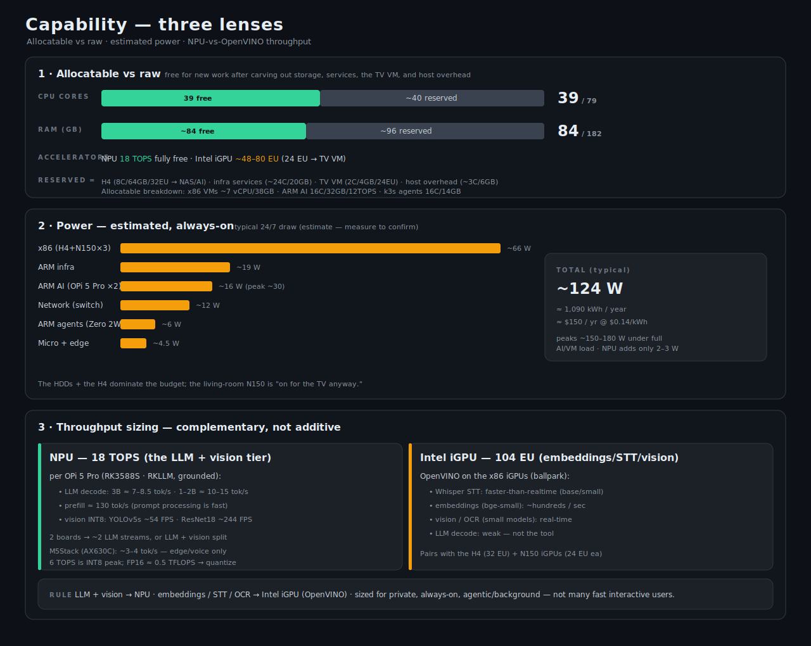

# Capability Overview

Totals across the 19-node fleet, classed the way the hardware actually divides. Built from
[HARDWARE.md](HARDWARE.md); see the infographic at
[diagrams/capability-overview.svg](diagrams/capability-overview.svg).

## Headline totals

| Metric | Total | Made of |
|--------|-------|---------|
| Nodes | **19** | physical units |
| CPU cores | **79** | 20 x86 + 59 ARM (+2 M5Stack MCU) |
| RAM | **~182 GB** | 112 GB x86 + ~70 GB ARM |
| Intel iGPU | **104 EU** | H4 (32) + N150 ×3 (24 ea) — OpenVINO |
| NPU | **18 TOPS** | OPi 5 Pro ×2 (12) + M5Stack (6) |

## By tier

| Tier | Nodes | Cores | RAM | GPU | NPU | Purpose |
|------|-------|-------|-----|-----|-----|---------|
| **x86 · Proxmox** | 4 | 20C/20T | 112 GB | 104 EU (Intel) | — | VMs + containers |
| **ARM AI · bare-metal** | 2 | 16C | 32 GB | Mali-G610 MP4 ×2 | 12 TOPS | RKLLama LLM + orchestrator |
| **ARM k3s agents** | 4 | 16C | 16 GB | Mali-G31 MP2 ×4 | — | containers (stateless) |
| **ARM infra / services** | 5 | 24C | 20 GB | VideoCore · Mali-T628 | — | Vault, LDAP, OctoPi, build |
| **Micro + edge** | 4 | 3C (+ESP32) | ~1.5 GB | — | 6 TOPS | edge AI + retirement-grade |

Counts reconcile: 4+2+4+5+4 = **19 nodes**; 20+16+16+24+3 = **79 cores**;
112+32+16+20+1.5 ≈ **182 GB**; 12+6 = **18 TOPS**.

## Accelerators — what each is for

- **104 Intel EU (OpenVINO).** The x86 iGPUs (H4 N305 32-EU + three N150 24-EU). These do the
  AI the NPUs are bad at: embeddings, Whisper STT, OCR, image/vision. No LLM NPU on Intel.
  (At ~8 ALU lanes per Xe EU that's on the order of ~830 FP lanes, but EU count is the useful
  figure for OpenVINO device sizing.)
- **18 TOPS NPU.** The OPi 5 Pro pair (RK3588S, 6 TOPS each = 12) plus the M5Stack AX630C (~6).
  This is the local-LLM / vision tier — RKLLama chat, vision models, and the edge escalation
  router — unified behind the LiteLLM gateway.
- **ARM Mali GPUs.** Mali-G610 MP4 ×2 on the OPi 5 Pros and Mali-G31 MP2 ×4 on the Zero 2W
  (your "~4 EU / 32 ALU-lane" estimate per board is a fair rough figure for the G31). Light
  OpenCL/Vulkan and display; minor compute next to the NPUs and Intel iGPUs.

## How to read it (allocation vs raw)

These are **raw** capability totals. Two allocation realities matter when planning:

- The **H4 (64 GB, 32 EU)** is dedicated to NAS/MinIO/AI, *not* a hypervisor — so the Proxmox
  cluster's usable x86 compute is really the **3× N150 ≈ 12C / 48 GB / 72 EU**.
- The **OPi 5 Pro** pair runs AI bare-metal, so their 16C/32 GB is for inference + the
  orchestrator, not general VMs.
- The **Zero 2W** pool is SD-backed — count it for stateless k3s pods, not storage/IO-heavy work.

## Lens 1 — allocatable vs raw

The totals above are **raw**. After carving out what's already committed, the compute genuinely
free for *new* lab workloads is roughly half:

| | Raw | Allocatable (free for new work) |
|---|---|---|
| CPU cores | 79 | **~39** |
| RAM | ~182 GB | **~84 GB** |
| NPU | 18 TOPS | **18 TOPS** (fully free) |
| Intel EU | 104 | **~48–80** (24 EU goes to the TV VM) |

**Reserved (~40 cores / ~96 GB):**
- **H4** — 8C / 64 GB / 32 EU → NAS, MinIO, backups, heavy AI. Not a hypervisor.
- **Infra services** — RPi 5 (Vault), RPi 4B (OpenLDAP), RPi 3B ×2 (OctoPi, DNS/QDevice), XU3
  (build) ≈ 24C / 20 GB, spoken-for by their roles.
- **TV/browse VM** — ~2 vCPU / 4 GB + the iGPU (24 EU) on N150 #3.
- **Hypervisor + OS overhead** — ~3C / 6 GB across the Proxmox nodes.

**Allocatable breakdown:**
- x86 VM pool (Proxmox) ≈ **7 vCPU / 38 GB** (3× N150 − TV VM − host overhead) + **48 EU** OpenVINO
- ARM AI (OPi 5 Pro ×2) = **16C / 32 GB / 12 TOPS** (bare-metal)
- ARM k3s agents (Zero 2W ×4) ≈ **16C / 14 GB** (stateless pods)

## Lens 2 — power / thermal (estimated, always-on)

Typical 24/7 draw. These are **estimates** — measure with a meter to confirm; spinning HDDs and
active AI inference push the top end higher.

| Tier | Nodes | Typical W |
|------|-------|-----------|
| x86 (H4 + N150 ×3) | 4 | ~66 W (H4 ~30 incl. 2 HDDs; N150 ~12 ea) |
| ARM AI (OPi 5 Pro ×2) | 2 | ~16 W (peak ~30 under inference) |
| ARM agents (Zero 2W ×4) | 4 | ~6 W |
| ARM infra (RPi 5/4B/3B×2/XU3) | 5 | ~19 W |
| Micro + edge (Zero W ×3 + M5Stack) | 4 | ~4.5 W |
| Network (2.5GbE switch) | — | ~12 W |
| **Total** | | **~124 W typical** |

≈ **1,090 kWh/year** → about **$150/yr** at $0.14/kWh (peaks ~150–180 W under full AI/VM load).
Notable: the NPU adds only ~2–3 W under load — the **HDDs and the H4 dominate**, and the
living-room N150 is "on for the TV anyway."

## Lens 3 — throughput sizing (NPU vs OpenVINO)

The 18 TOPS and 104 EU are **not interchangeable** — they're complementary engines for different
jobs. NPU figures are grounded in community RK3588 benchmarks; the OpenVINO figures are ballpark.

**NPU (per OPi 5 Pro · RK3588S · RKLLM):**
- LLM decode: **3B ≈ 7–8.5 tok/s**, **1–2B ≈ 10–15 tok/s**; prefill ~130 tok/s
- Vision (INT8): YOLOv5s **~54 FPS**, ResNet18 **~244 FPS**
- Two boards → ~2 concurrent LLM streams, or one LLM + one vision
- M5Stack (AX630C): ~3–4 tok/s (tiny model) — edge/voice only
- 6 TOPS is INT8 peak; FP16 ≈ 0.5 TFLOPS, so quantize

**Intel iGPU / OpenVINO (104 EU · 24–32 per node) — ballpark:**
- Whisper STT: faster-than-realtime (base/small)
- Embeddings (bge-small): ~hundreds/sec
- Vision/OCR (small models): real-time
- LLM decode: **weak — not the tool**; route LLM to the NPU

**Planning rule:** LLM + vision → **NPU**; embeddings / STT / OCR → **Intel iGPU (OpenVINO)**.
Single-digit-to-~15 tok/s per LLM stream means this tier is sized for **private, always-on,
agentic/background** work — not many fast interactive users.

## Method / caveats

Cores = physical cores (threads noted where SMT applies — only the H4 and N150 are x86, all
ARM here is 1 thread/core). RAM sums nameplate capacity (the H4's 64 GB is over its 48 GB
spec). The M5Stack's ESP32-S3 (2 MCU cores) is excluded from the 79-core figure. ARM GPU and
the Zero 2W ALU-lane figures are approximate — vendor docs for the Mali-G31/H618 are sparse.
