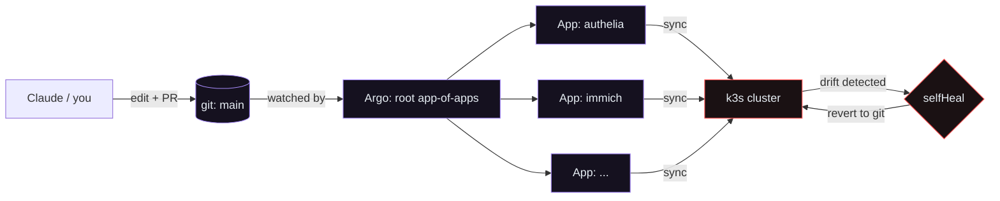
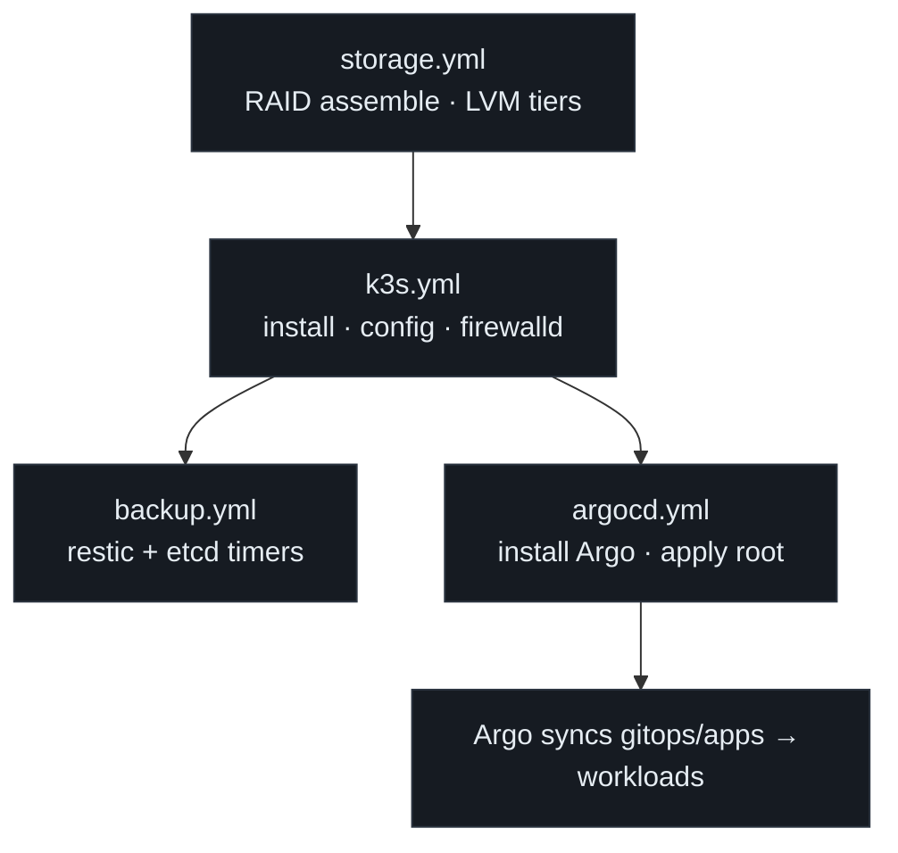
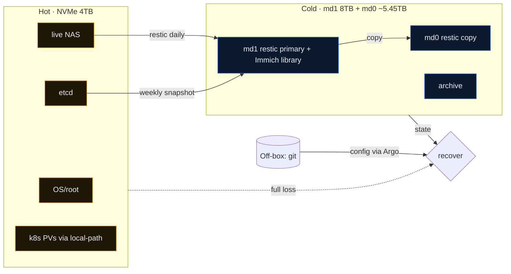

# Architecture

This lab has one always-on **core** (the H4 Ultra) carrying the cluster and storage, a
small set of **support roles** (DNS, edge AI, identity), and an optional **ARM expansion
fleet**. Everything that runs inside the cluster is declared in git and reconciled by Argo CD.

## The three layers

| Layer | Tool | Owns | Blast radius |
|-------|------|------|--------------|
| Host | **Ansible** | OS config, storage (LVM/RAID), k3s install, backups | Whole box — gate hardest |
| Cluster | **Argo CD** | Namespaces, workloads, Ingress, config inside k3s | Recoverable from git |
| VMs | **KVM / libvirt** | lldap and other services on n150-1/n150-2 hypervisors | Per-VM |

Ansible runs rarely (setup and changes you approve). Argo runs continuously. Claude lives
mostly in the git/Argo layer.

## The core node — k3s on the H4 Ultra

k3s is Rancher's lightweight, single-binary Kubernetes distribution. It runs as a **single
systemd service** on a normal Linux host, so the NAS services (`smbd`/`nfs`) coexist as
ordinary host processes. It brings a minimal control plane (containerd, Flannel CNI,
embedded etcd), **Traefik** as the default ingress controller (so you use standard
`networking.k8s.io/v1 Ingress` objects), and the **local-path** StorageClass for dynamic
persistent volumes on the NVMe — but drops the heavy parts of full Kubernetes distributions.
That's exactly the footprint trade that lets it share an 8-core box with a NAS.

The node sits on the H4's 2.5GbE NIC (Intel I226-V) at `192.168.1.160`. The OS lives on
the 256 GB eMMC, leaving the whole NVMe for etcd + PVs + live NAS. The base domain is
`lab.home.arpa` (RFC 8375 reserved for home networks), so an Ingress named `web` resolves
as `web.apps.lab.home.arpa`.

**opi5pro-2** (`192.168.1.172`) runs as a k3s agent — extra compute for workloads that can
tolerate arm64. Add it to a workload with `nodeSelector: kubernetes.io/arch: arm64`.

## GitOps reconcile loop

The cluster's desired state is this repo. Argo's `app-of-apps` root watches `gitops/apps/`;
each file there is itself an `Application` pointing at a directory under
`gitops/workloads/`. With `selfHeal` and `prune` on, the live cluster is continuously
forced to match git.

The practical upshot: there is almost no imperative `kubectl apply` in normal operation. To
change the cluster you change git; to undo a change you `git revert`. This is also what
makes letting an agent near the cluster safe — its changes are diffs you review, and
anything it does out of band gets reconciled away.

## Bootstrap order

Stages are independent playbooks so you can run and verify them one at a time. Storage must
exist before k3s starts (etcd and PVs need the NVMe); Argo comes last.

## Storage tiers

A single fast NVMe holds everything latency-sensitive; two SATA disks hold cold copies;
git holds desired state. Cold storage is two mdadm RAID 1 mirrors — 8 TB primary
(`/mnt/cold-8t`) + ~5.45 TB secondary (`/mnt/cold-sec`); each survives a disk failure.
Because the NVMe is fast (high random IOPS), co-locating etcd with NAS I/O is fine — the
classic "etcd hates shared storage" warning applies to slow spinning disks, not NVMe.
The real risks are space contention (handled by LVM separation) and the box being a single
failure domain (handled by two independent cold copies plus git).

## Network & DNS

The lab is a flat **192.168.1.0/24** network; the H4 is wired at 2.5 Gbps (Intel I226-V)
at `192.168.1.160`. **DNS is the linchpin of the install** — k3s needs an
`api.lab.home.arpa` record and a wildcard `*.apps.lab.home.arpa`, both pointing at
`192.168.1.160`. Pi-hole (octopi, `.148`) is the LAN resolver; it delegates
`lab.home.arpa` to itself via `dnsmasq` custom records.

Inside the cluster, CoreDNS has a custom zone (`coredns-custom` ConfigMap in kube-system)
that answers all `*.apps.lab.home.arpa` queries with `192.168.1.160`, ensuring pods on any
node (including the arm64 agent) resolve Ingress names without relying on the host's
`systemd-resolved`.

## Identity & SSO

**lldap** (`ldap-1` VM on n150-1, `192.168.1.70:3890`) is the LDAP directory — a
lightweight read-optimised server with a simple web UI at port 17170. It holds lab users
and groups.

**Authelia** runs in k3s (`authelia.apps.lab.home.arpa`) as an OIDC provider backed by
lldap. It gates SSO for apps that support OIDC but not LDAP directly (Immich). The OIDC
private key and all secrets live in the `authelia-secrets` k8s Secret (created manually,
not in git).

**cert-manager** (`lab-ca` ClusterIssuer) signs TLS certs for all `*.apps.lab.home.arpa`
Ingresses using a self-signed lab root CA stored in the `lab-root-ca` secret.

## Where the rest of the fleet fits

The H4 is the only box that can carry a real control plane plus storage, so it stays the
core. The other hardware has defined supporting roles:

- **n150-1 / n150-2** (`192.168.1.42` / `192.168.1.21`) — KVM hypervisors (Ubuntu 24.04).
  Currently host `ldap-1` (lldap). NPU-capable; candidate inference nodes.
- **Orange Pi 5 Pro ×2 (8C/16 GB/NPU)** — opi5pro-1 runs RKLLama + LiteLLM gateway;
  opi5pro-2 is a k3s agent (`192.168.1.172`).
- **RPi 5** (`192.168.1.128`) — HashiCorp Vault.
- **RPi 4B** (`192.168.1.99`) — available (previously OpenLDAP, now superseded by lldap).
- **octopi (RPi 3B #2)** (`192.168.1.148`) — Pi-hole DNS.
- **opi-zero2w-2** (`192.168.1.188`) — MQTT broker (Mosquitto).
- **xu3-1** (`192.168.1.64`) — build agent.
- **M5Stack + OPi NPUs** — edge inference endpoints, not cluster nodes.

## Security posture (summary)

The box is the blast-radius boundary: scoped credentials, no `root`-equivalents for
cluster operations, and a permission config (`.claude/settings.json`) that allows reads,
asks before mutations, and denies destructive storage operations outright. Secrets never
committed to git; OIDC/Authelia secrets created out-of-band. Full model in
[SECURITY.md](SECURITY.md).

## Service map

Grouped services and the hosts that provide them:

An **interactive, filterable** version (toggle hardware classes, select-all/clear) is at
[service-map.html](service-map.html) — open it in a browser. A **host-centric** companion
(one card per box, everything it runs, same filters) is at [host-map.html](host-map.html).
