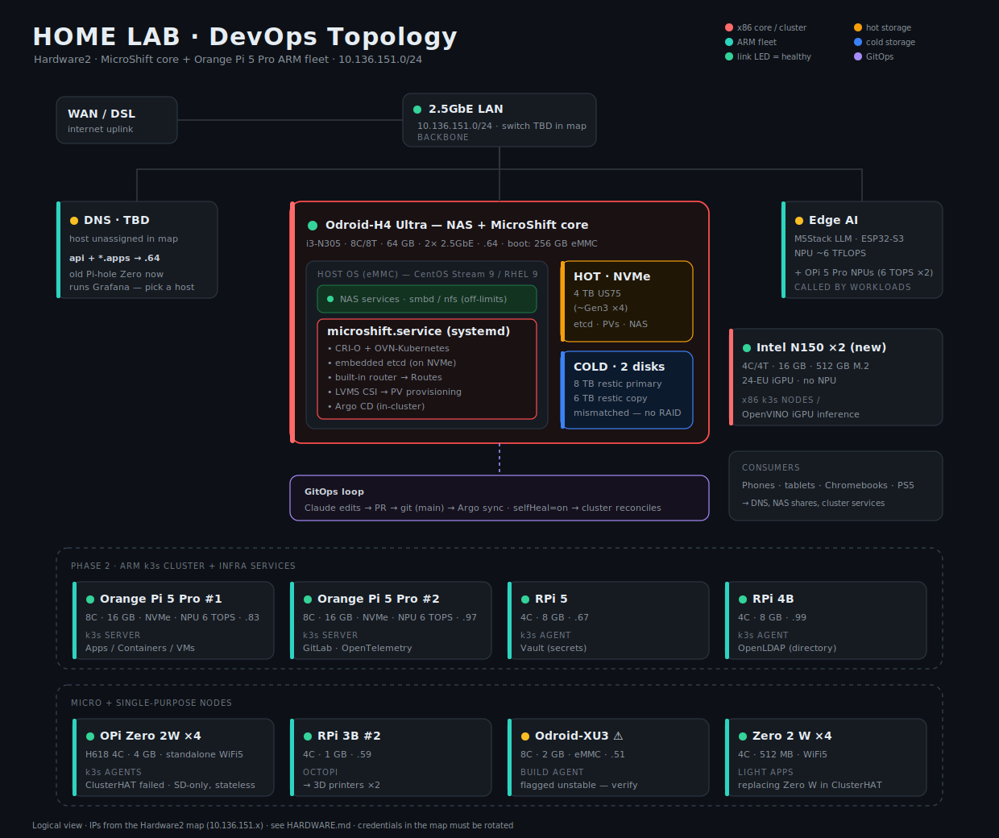
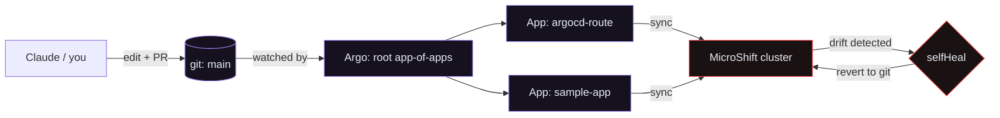
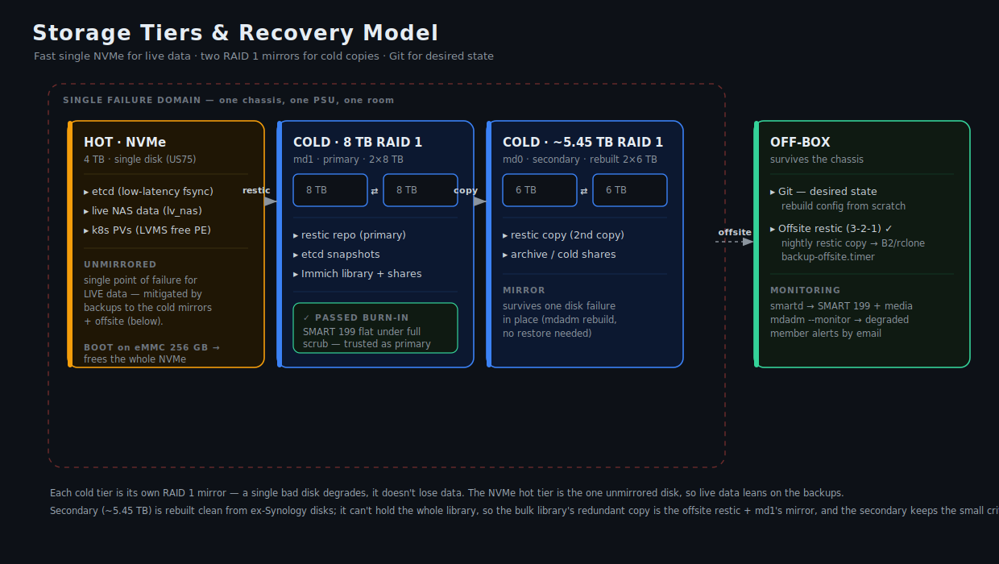
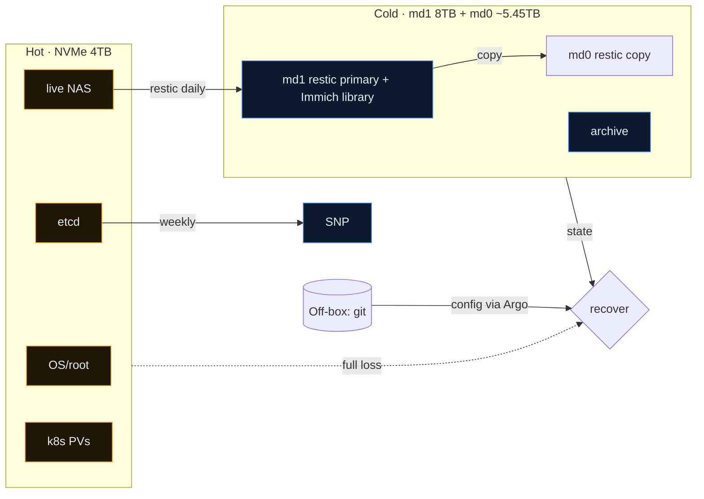
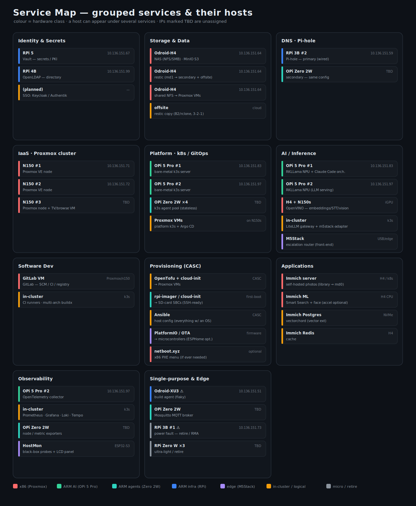

# Architecture

This lab has one always-on **core** (the H4 Ultra) carrying the cluster and storage, a
small set of **support roles** (DNS, edge AI), and an optional **ARM expansion fleet**.
Everything that runs inside the cluster is declared in git and reconciled by Argo CD.

## The three layers

The original design goal spanned provisioning → config → orchestration. On this single
box those collapse into a clean division of ownership:

| Layer | Tool | Owns | Blast radius |
|-------|------|------|--------------|
| Host | **Ansible** | OS config, storage (LVM/RAID), MicroShift install, backups | Whole box — gate hardest |
| Cluster | **Argo CD** | Namespaces, workloads, Routes, config inside MicroShift | Recoverable from git |
| (future) VMs | **Terraform** | Proxmox VMs for a separate cluster, if ever added | N/A on this box |

Ansible runs rarely (setup and changes you approve). Argo runs continuously. Claude lives
mostly in the git/Argo layer.

## The core node — MicroShift on the H4 Ultra

MicroShift is Red Hat's stripped-down OpenShift derivative for constrained hardware. It
runs as a **single systemd service** on a normal Linux host, so the NAS services
(`smbd`/`nfs`) coexist as ordinary host processes. It brings a minimal control plane
(CRI-O, OVN-Kubernetes, embedded etcd), the OpenShift **router** (so you get `Route`
objects), and the **LVMS** CSI driver for dynamic persistent volumes — but drops the heavy
parts of full OpenShift (OLM, the monitoring stack, the web console by default). That's
exactly the footprint trade that lets it share an 8-core box with a NAS.

The node sits on the H4's 2.5GbE NIC (Intel I226-V) at `10.136.151.64`. The OS can live on
the 256 GB eMMC, leaving the whole NVMe for etcd + PVs + live NAS. The base domain is
`lab.home.arpa` (the RFC 8375 reserved domain for home networks), so a `Route` named `web`
becomes `web.apps.lab.home.arpa`.

## GitOps reconcile loop

The cluster's desired state is this repo. Argo's `app-of-apps` root watches `gitops/apps/`;
each file there is itself an `Application` pointing at a directory under
`gitops/workloads/`. With `selfHeal` and `prune` on, the live cluster is continuously
forced to match git.

The practical upshot: there is almost no imperative `oc apply` in normal operation. To
change the cluster you change git; to undo a change you `git revert`. This is also what
makes letting an agent near the cluster safe — its changes are diffs you review, and
anything it does out of band gets reconciled away.

## Bootstrap order

Stages are independent playbooks so you can run and verify them one at a time. Storage must
exist before MicroShift starts (etcd and PVs need the VG); Argo comes last.

## Storage tiers

A single fast NVMe holds everything latency-sensitive; two SATA disks hold cold copies;
git holds desired state. (Cold storage is two mdadm RAID 1 mirrors — 8 TB primary + ~5.45 TB secondary; each survives a disk failure. Was two independent
disks with a restic copy between them, not a RAID 1 mirror.) Because the NVMe is fast (high random IOPS), co-locating etcd with
NAS I/O is fine — the classic "etcd hates shared storage" warning applies to slow spinning
disks, not this. The real risks here are space contention (handled by LVM separation) and
the box being a single failure domain (handled by two independent cold copies plus git, with
an offsite copy on the roadmap).

## Network & DNS

The lab is a flat `10.136.151.0/24`; the H4 is wired at 2.5 Gbps (Intel I226-V). **DNS is the
linchpin of the install** — MicroShift needs an `api.lab.home.arpa` record and a wildcard
`*.apps.lab.home.arpa`, both pointing at the node IP (`10.136.151.64`). The updated map leaves
DNS **unassigned** (the old Pi-hole Zero now runs Grafana), so giving DNS a stable home is a
first task. Missing DNS is the number-one cause of failed installs. The exact records are
in [RUNBOOK.md](RUNBOOK.md#dns-records).

## Where the rest of the fleet fits

The H4 is the only box that can carry a real control plane plus storage, so it stays the
core. The other hardware has defined supporting roles rather than being forced into one
cluster — see [HARDWARE.md](HARDWARE.md) for the full mapping. The headline placements:

- **DNS — needs a host.** The updated map shows the old Pi-hole Zero now running Grafana and no node assigned to DNS. It's load-bearing for the cluster, so pick a stable host (see HARDWARE.md).
- **Orange Pi 5 Pro ×2 (8C/16 GB/NPU)** — the strongest ARM nodes; the natural k3s control
  plane for an *optional* Phase-2 cluster, and already hosting GitLab. **RPi 5 / 4B** are
  agents (also running Vault and OpenLDAP); the **XU3** is a build agent (flagged unstable).
  MicroShift is single-node by design, so this ARM multi-node cluster is separate — Argo can
  target it too.
- **M5Stack LLM + the OPi 5 Pro NPUs (~18 TOPS total)** — edge AI inference endpoints
  workloads can call; not cluster nodes.
- **OctoPi (RPi 3B #2)** — drives the 3D printers. (The first map's Atomic Pi, ESP8266, and
  laptop are absent from Hardware2 — assumed retired.)

## Security posture (summary)

The box is the blast-radius boundary: scoped credentials, no `root@pam`-equivalents, and a
permission config (`.claude/settings.json`) that allows reads, asks before mutations, and
denies destructive storage/SCC operations outright. Full model in
[SECURITY.md](SECURITY.md).

## Service map

Grouped services and the hosts that provide them:

An **interactive, filterable** version (toggle hardware classes, select-all/clear) is at [service-map.html](service-map.html) — open it in a browser. A **host-centric** companion (one card per box, everything it runs, same filters) is at [host-map.html](host-map.html).
