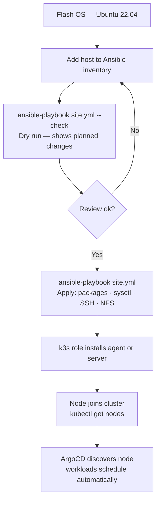
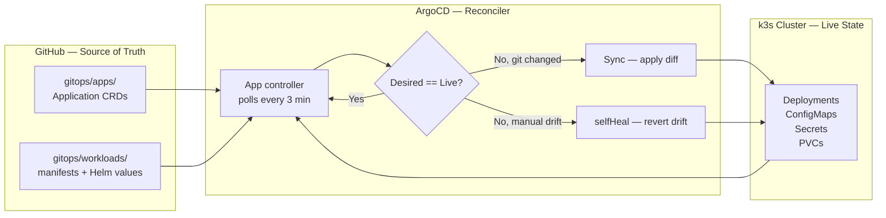
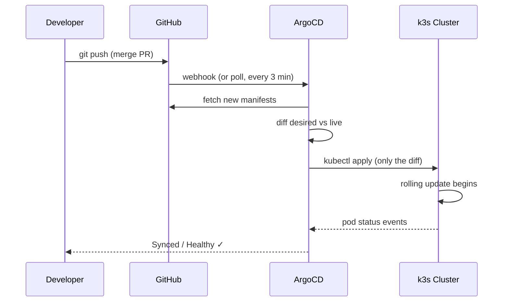
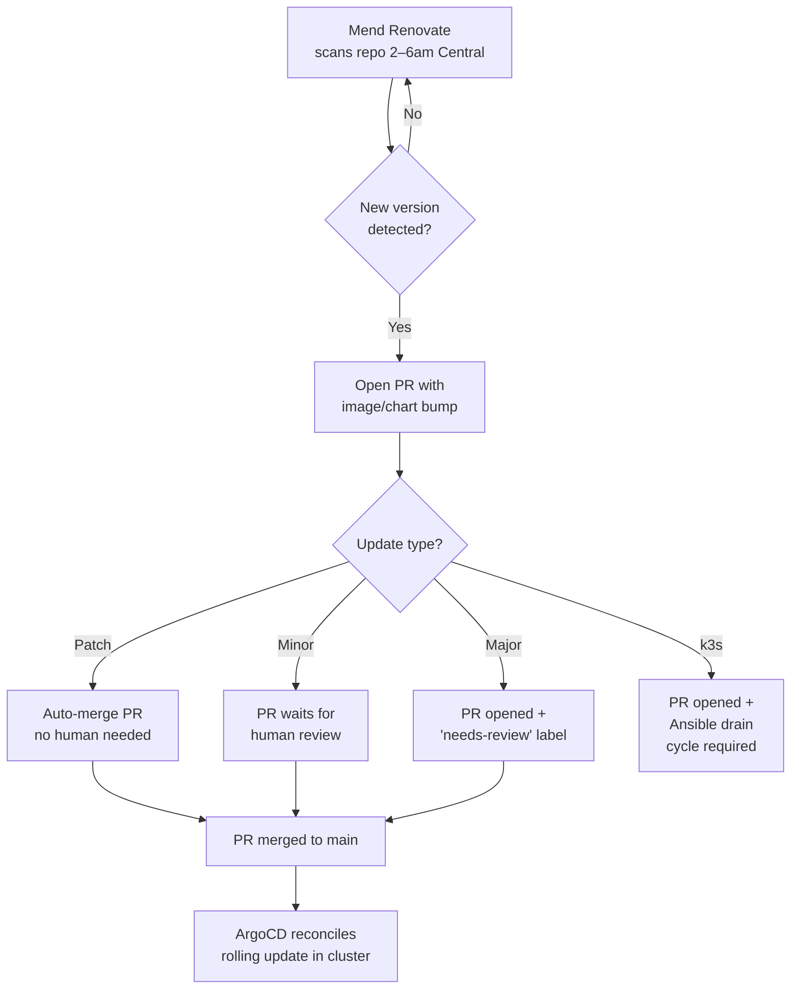
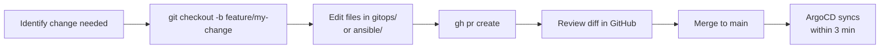
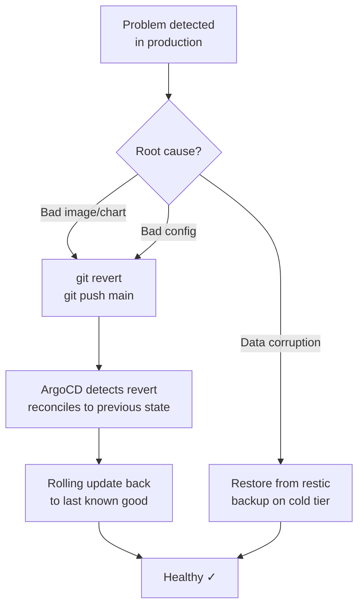
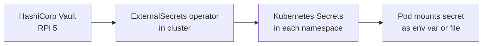
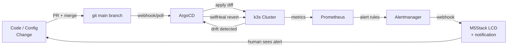
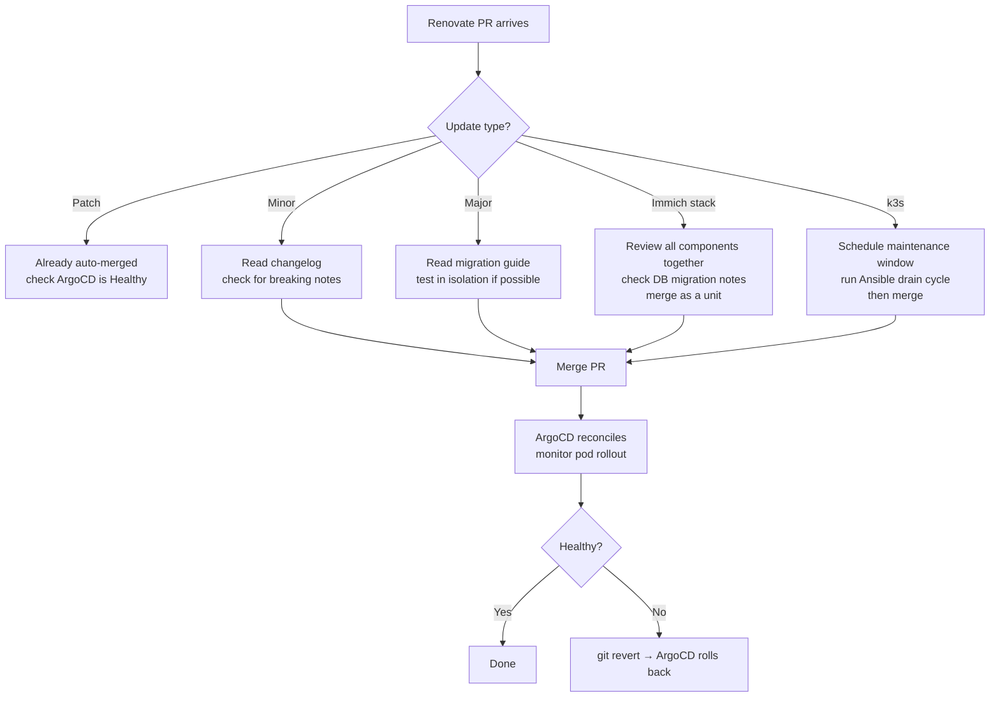

# GitOps & DevOps Study Guide — Home Lab

This guide explains how the lab is provisioned, updated, rolled back, and kept running.
It uses the actual infrastructure as the working example throughout.

---

## 1. The Core Philosophy

The lab is operated on one principle: **git is the single source of truth for everything**.

No configuration exists on any host or in the cluster that is not either:
- Checked into `gitops/` (cluster workloads), or
- Applied by an Ansible playbook in `ansible/` (host-level config)

This means the entire lab can be reconstructed from the git repo and a fresh hardware
install. It also means nothing drifts silently — any manual change gets reverted
automatically.

> **GitOps definition:** a practice where the desired state of infrastructure is declared
> in git, and an automated operator continuously reconciles the running state to match it.

---

## 2. The Layered Stack

The lab is built in four layers, each managed by a different tool:

```
┌─────────────────────────────────────────────────────────┐
│  Layer 4 — Workloads                                     │
│  ArgoCD reconciles gitops/ → k3s cluster                │
│  (Authelia, Immich, Grafana, LiteLLM, Whisper …)        │
│  Kyverno admission policies enforce image + security     │
├─────────────────────────────────────────────────────────┤
│  Layer 3 — Kubernetes (k3s)                             │
│  Installed and upgraded via Ansible                      │
│  Traefik ingress · local-path storage · CoreDNS         │
│  3-server HA cluster (H4 + n150-1 + n150-2, etcd quorum)│
├─────────────────────────────────────────────────────────┤
│  Layer 2 — OS / Host config                             │
│  Ansible playbooks: packages, sysctl, NFS, RAID, users  │
│  Semaphore web UI at semaphore.apps.lab.home.arpa        │
├─────────────────────────────────────────────────────────┤
│  Layer 1 — Hardware + VMs                               │
│  Odroid-H4 Ultra · N150 nodes · OPi 5 Pro · RPi 5/4B   │
│  KVM VMs on n150-1/2; gitlab-1 codified in tofu/vms/    │
└─────────────────────────────────────────────────────────┘
```

Each layer has a dedicated change process. Changes to Layer 2 go through Ansible, not
kubectl. Changes to Layer 4 go through git, not kubectl apply. **The layers never bleed
into each other.**

---

## 3. Provisioning — How a New Node Joins

Bringing a new machine into the lab follows a repeatable sequence.



**Key Ansible roles applied to every node:**
- `common` — base packages, SSH hardening, NTP, hostname
- `k3s` — installs pinned k3s version from group_vars, configures server vs agent role
- `nfs-client` — mounts NAS shares (NAS itself is off-limits to automation)
- `restic` — installs backup agent and timers (etcd backup on server nodes)

The k3s version is pinned in `ansible/inventory/group_vars/all/k3s.yml` with a Renovate
comment so version bumps arrive as PRs:

```yaml
# renovate: datasource=github-releases depName=rancher/k3s
k3s_version: "v1.30.2+k3s1"
```

---

## 4. The GitOps Reconciliation Loop

Once the cluster is running, ArgoCD takes over management of everything inside it.

### Application discovery — ApplicationSet

Standard workloads are discovered automatically via the **git directory generator** in
`gitops/apps/workloads-appset.yaml`. Any directory added under `gitops/workloads/` becomes
an ArgoCD Application without a manual `gitops/apps/` entry:

```
gitops/workloads/
  my-new-app/          ← ArgoCD detects this automatically
    deployment.yaml
    service.yaml
```

The `gitops/apps/` directory is reserved for Helm chart Applications and system-level
components (kyverno, cert-manager, external-secrets, monitoring stack) that need special
Helm values or install options. Standard manifests go straight into `gitops/workloads/`.



**`selfHeal: true`** is the critical setting. If anyone runs `kubectl apply` or edits a
resource directly, ArgoCD detects the drift and reverts it within minutes. This prevents
the classic ops problem of "the cluster is different from what we think it is."

**`automated: prune: true`** means resources deleted from git are also deleted from the
cluster — no orphaned objects accumulate.

### Config-reload without a sync — Reloader

When a ConfigMap or Secret changes (new OIDC client, rotated credential), the Deployment
itself hasn't changed so ArgoCD won't restart the pod. **Stakater Reloader** handles this:
any Deployment annotated with `reloader.stakater.com/auto: "true"` is automatically
restarted whenever a mounted ConfigMap or Secret changes.

Authelia, Semaphore, and Zot all carry this annotation. Without it, a config change merged
to main would silently sit in the ConfigMap while the pod keeps running the old config.

### Example — what happens when you commit a change



The developer pushes one commit. Everything else is automatic.

---

## 5. Container & Dependency Updates

Keeping images and Helm charts current is handled by **Mend Renovate**, running as a
GitHub App against the HomeLab repo.



**Special rules in `renovate.json`:**

| Package | Rule | Reason |
|---|---|---|
| `ghcr.io/immich-app/*` | Grouped, Monday 4am, no auto-merge | All Immich components must update together or the DB schema breaks |
| `rancher/k3s` | Never auto-merge | k3s upgrades need the Ansible drain cycle (cordon → drain → upgrade → uncordon) |
| `registry.apps.lab.home.arpa/*` | Disabled | Private registry — Renovate can't reach it |
| Everything else (patch) | Auto-merge | Low risk; ArgoCD rolls back if it breaks |

---

## 6. Making a Configuration Change

Configuration changes (not version bumps) follow the same git-first flow.



**Example — the Authelia session timeout fix from this session:**

```bash
# 1. Create branch
git checkout -b fix/authelia-session-timeouts

# 2. Edit gitops/workloads/authelia/configmap.yaml
#    inactivity: 5m  →  1h
#    expiration:  1h  →  24h

# 3. Open PR
gh pr create --title "fix(authelia): increase session timeouts"

# 4. Merge → ArgoCD reconciles → Authelia pods restart with new config
```

The git history is the audit log. `git log` tells you exactly what changed, who changed
it, and when.

---

## 7. Admission Policy — Kyverno

All workload changes pass through **Kyverno** before they reach the cluster. Three
ClusterPolicies are in **Enforce** mode — violations are rejected at admission, not just
flagged after the fact:

| Policy | What it checks |
|---|---|
| `disallow-latest-tag` | Every container image must have an explicit, pinned tag (not `:latest` or untagged) |
| `require-resource-limits` | Every container must declare `resources.limits.cpu` and `resources.limits.memory` |
| `disallow-privileged-containers` | `privileged: true` is banned; fix with proper `securityContext` instead |

These are checked by ArgoCD's dry-run CI step and enforced again at apply time. If a
Renovate PR pins a new image to `:latest`, CI fails before it can be merged.

**What to do when a new workload is rejected:**

```bash
# Kyverno will tell you exactly which rule failed and why
kubectl describe pod <pod> -n <namespace> | grep "admission webhook"

# Common fixes:
# 1. Pin the image tag:  image: myapp:1.2.3  (not myapp or myapp:latest)
# 2. Add resource limits to every container in the spec
# 3. Remove privileged: true; use capabilities instead if needed
```

Exempted namespaces: `kube-system`, `kyverno`, `argocd` (cluster infrastructure that
predates or bootstraps policy enforcement).

---

## 8. Rollbacks

Because the cluster state is entirely derived from git, rolling back is just reverting a commit.



**Example — rolling back a broken Grafana update:**

```bash
# Find the bad commit
git log --oneline gitops/apps/monitoring.yaml

# Revert it
git revert abc1234
git push origin main

# ArgoCD sees the revert within 3 minutes and rolls Grafana back
# No kubectl, no downtime beyond the pod restart
```

This works because `selfHeal: true` means ArgoCD is always watching. As soon as the
reverted state lands in git, ArgoCD applies it.

**ArgoCD also keeps rollback history in the UI** — you can click "Rollback" on a previous
sync revision without touching git at all, though a git revert is preferred since it keeps
the audit log clean.

---

## 9. Storage & Data Protection

The lab runs two storage tiers with independent failure domains for data safety.

```
┌──────────────────────────────────────────────────────────────────┐
│  HOT TIER — 4TB NVMe (LVM on /dev/loop100)                       │
│  • OS on 256GB eMMC (separate)                                    │
│  • k3s PersistentVolumes via local-path StorageClass             │
│  • Live NAS data (lv_nas — off-limits to cluster automation)     │
└────────────────────┬─────────────────────────────────────────────┘
                     │ restic backup (backup-nas timer)
                     ▼
┌──────────────────────────────────────────────────────────────────┐
│  COLD TIER — SATA RAID 1 mirrors                                 │
│  • Primary:   8TB  (/mnt/cold-8t)                                │
│  • Secondary: ~5.45TB (/mnt/cold-sec)                            │
│  • Only copy-of-record for NAS data and cluster state            │
│  • Never mkfs/wipefs — never run restic prune manually           │
└──────────────────────────────────────────────────────────────────┘
```

**Backup timers (systemd, never disabled):**

| Timer | When | What it backs up | Destination |
|---|---|---|---|
| `backup-nas` | 01:30 | NAS data (`/srv/nas`, VMs, Immich library) | Cold RAID tier (md1 primary → md0 copy) |
| `backup-etcd` | daily | k3s etcd snapshots | Cold RAID tier |
| `backup-vault` | 02:30 | Vault raft snapshot | Cold RAID tier |
| `backup-cloud` | 03:00 | **Offsite.** etcd snapshots + lldap + Vault snapshots + Postgres dumps (Authelia, Immich, Semaphore) | Cloudflare R2 (free 10 GB tier) |

Before any storage change on the hot tier, the last backup timestamp is confirmed. This
is the one manual gate in an otherwise automated system — it protects against the scenario
where a hot-tier change and a cold-tier failure happen simultaneously.

---

## 10. Secrets Management

Secrets never live in plain text in git. The chain:



- Vault is the authoritative secrets store, running on a dedicated RPi 5
- ExternalSecrets polls Vault and syncs values into Kubernetes Secrets
- Kubernetes Secrets are ephemeral — if the cluster is rebuilt, ExternalSecrets
  re-populates them from Vault automatically
- Nothing in `gitops/` contains a real credential — only references to Vault paths

---

## 11. Observability

The monitoring stack (kube-prometheus-stack) gives three layers of visibility:

```
┌─────────────────────────────────────────────────────────┐
│  Grafana — dashboards                                    │
│  Lab Health · k3s nodes · RAID · VMs · AI inference     │
├─────────────────────────────────────────────────────────┤
│  Alertmanager — routing                                  │
│  Real alerts → M5Stack webhook → LCD display            │
│  Watchdog / InfoInhibitor → null receiver (noise)        │
├─────────────────────────────────────────────────────────┤
│  Prometheus — metrics collection                         │
│  node-exporter (all nodes) · kube-state-metrics          │
│  libvirt (KVM hosts) · external static targets           │
│  30-day retention · 50GB storage                         │
└─────────────────────────────────────────────────────────┘
```

External hosts (VMs, OPis, DNS servers) that are not k3s nodes are scraped via
`additionalScrapeConfigs` static targets — no agent install needed, just port 9100 open.

---

## 12. How This Enables High Uptime

High uptime in a homelab is harder than in a datacenter — one failure domain, consumer
hardware, no on-call team. GitOps compensates with automation that catches and corrects
problems faster than a human can.

### The uptime pillars

**1. Self-healing reconciliation**
ArgoCD's `selfHeal` reverts any manual change or configuration drift within minutes.
The cluster always matches the declared state in git — there's no "mystery config" that
breaks at 2am.

**2. Automated dependency updates**
Renovate patches images daily in the background. CVEs in container images get fixed by
a PR that auto-merges before you wake up. Without this, image versions stagnate and
vulnerabilities accumulate.

**3. Controlled rollback**
Any bad update is one `git revert` away from recovery. Because the desired state is in
git, ArgoCD can reconcile backwards as easily as forwards. Mean time to recovery (MTTR)
is minutes, not hours.

**4. No manual state**
`kubectl apply` to `main` directly is forbidden. Every change goes through a PR. This
means there is no undocumented state — the git history *is* the operational log.

**5. Storage isolation**
The cold RAID tier holds the only copy-of-record for data. The hot tier (NVMe) holds
live working state. A failed NVMe replacement does not lose NAS data or cluster state —
it's all on the cold tier, and etcd snapshots let k3s restore itself.

**6. Independent failure domains**
The NAS services (`smbd`/`nfs`) and their backup timers are explicitly off-limits to
cluster automation. Even if ArgoCD or k3s fails entirely, the NAS keeps serving. The two
layers are operationally independent.

### Failure modes and mitigations

| Failure | Impact | Mitigation |
|---|---|---|
| Bad image pushed by Renovate | App pod CrashLoopBackOff | `git revert` → ArgoCD rolls back in minutes |
| Manual `kubectl edit` drifts config | Unexpected behaviour | `selfHeal` reverts within 3 min |
| k3s node goes offline | Pods reschedule (if multi-node) | k3s reschedules to remaining agents |
| NVMe hot tier failure | NAS down, k3s PVs lost | Restore from cold RAID + etcd snapshot |
| Cold RAID disk failure | RAID degrades, data intact | Replace disk, RAID rebuilds automatically |
| ArgoCD itself fails | No new reconciliation | Cluster keeps running; ArgoCD is stateless, restarts cleanly |
| Vault unavailable | ExternalSecrets can't refresh | Existing Kubernetes Secrets still valid until pod restarts |

### The GitOps uptime loop



Every component feeds back into the loop. Drift is corrected automatically. Alerts
surface problems before they become outages. Changes are always reversible. The result
is that the lab runs reliably on hardware that has no redundant power, no UPS, and no
on-call rotation — because the software layer compensates for the hardware constraints.

---

## 13. Routine Maintenance

Most maintenance is automated. What remains for a human:

### Weekly (low effort)
- Glance at open Renovate PRs — merge minor/major updates that have been reviewed
- Check Grafana Lab Health dashboard — RAID state, backup timer last-run timestamps,
  disk usage trends
- Verify `backup-nas` and `backup-etcd` timers fired successfully:
  ```bash
  systemctl status backup-nas.timer backup-etcd.timer
  journalctl -u backup-nas.service --since "7 days ago" | grep -E "finished|error"
  ```

### When a Renovate PR arrives



### k3s version upgrade (manual gate)

k3s upgrades are the one update that requires human orchestration because nodes must be
drained before the upgrade and uncordoned after. Renovate opens the PR but **do not
merge until the drain cycle is complete**:

```bash
# 1. Drain the node (or each agent in turn for multi-node)
kubectl cordon <node>
kubectl drain <node> --ignore-daemonsets --delete-emptydir-data

# 2. Run the Ansible k3s upgrade playbook (applies the new version from group_vars)
ansible-playbook ansible/site.yml --tags k3s --check   # dry run first
ansible-playbook ansible/site.yml --tags k3s

# 3. Verify node is back and healthy
kubectl get nodes
kubectl uncordon <node>

# 4. Merge the Renovate PR — ArgoCD reconciles (no-op for the cluster state itself)
```

### Certificate rotation

Certificates are managed by cert-manager with `lab-ca` ClusterIssuer. They auto-renew
30 days before expiry. Manual action is only needed if the CA itself expires:

```bash
# Check cert expiry across all namespaces
kubectl get certificates -A
# Look for READY=False or short EXPIRY
```

### Vault token / seal

Vault runs on the RPi 5. On reboot it is sealed and requires an unseal key. If
ExternalSecrets starts reporting sync failures after a reboot, Vault is likely sealed:

```bash
# On the RPi running Vault
vault status
vault operator unseal   # enter unseal key
```

---

## 14. Troubleshooting Guide

### Diagnostic hierarchy

Always check in this order — most problems are visible at a higher layer before reaching
the workload:

```
1. DNS  →  2. Networking  →  3. ArgoCD sync  →  4. Pod state  →  5. App logs
```

DNS is load-bearing in this cluster. `api.lab.home.arpa` and `*.apps.lab.home.arpa`
must resolve to `192.168.1.160`. If an Ingress stops working, check DNS first.

---

### ArgoCD shows Progressing / Degraded

```bash
# 1. Find which resource is non-healthy (blank health = not computed yet)
kubectl get application <name> -n argocd -o json | \
  jq '.status.resources[] | {kind, name, health}'

# 2. Force a hard refresh (triggers re-evaluation of all resource health)
kubectl annotate application <name> -n argocd \
  argocd.argoproj.io/refresh=hard --overwrite

# 3. Check app controller logs for this app
kubectl logs -n argocd statefulset/argocd-application-controller --since=5m \
  | grep '"application":"<name>"'

# 4. Check events in the affected namespace
kubectl get events -n <namespace> --sort-by='.lastTimestamp' | tail -20
```

Common causes:
- **PVC Pending (no consumer)** — a PVC manifest exists in git but no pod mounts it.
  With `local-path` (WaitForFirstConsumer binding mode), the PVC stays Pending forever
  because the provisioner waits for a pod to schedule. ArgoCD evaluates the PVC as
  Progressing and rolls it up to the whole app. Fix: delete the orphaned PVC manifest
  from git; ArgoCD prune removes it from the cluster on next sync.
- **PVC Pending (provisioner error)** — local-path can't create the directory; check
  node affinity and that the storage path exists on the target node.
- **ImagePullBackOff** — new image tag doesn't exist yet, or registry is unreachable
- **CrashLoopBackOff** — check `kubectl logs <pod> --previous` for the crash reason
- **Stale health** — ArgoCD health cache not refreshed; use the hard refresh above

---

### Pod is CrashLoopBackOff

```bash
# See why the last run crashed
kubectl logs <pod> -n <namespace> --previous

# Check resource limits (OOMKilled shows up here)
kubectl describe pod <pod> -n <namespace> | grep -A 5 "Last State"

# Check events on the pod
kubectl describe pod <pod> -n <namespace> | grep -A 20 Events
```

Common causes and fixes:

| Symptom in logs | Cause | Fix |
|---|---|---|
| `Permission denied` on a volume path | init container or mount ownership mismatch | Check `securityContext.runAsUser`; may need `initChownData` disabled or a manual `chown` on the host path |
| `connection refused` to another service | Dependency not ready yet | Check the dependency pod is Running; check Service selector matches pod labels |
| `exec format error` | Wrong image architecture (e.g. amd64 image on ARM node) | Check image supports the node's arch; add `nodeSelector` |
| Secret key not found | ExternalSecret hasn't synced yet | `kubectl get externalsecrets -n <ns>` — check Ready status |

---

### Ingress not resolving

```bash
# 1. DNS first
nslookup <hostname>.apps.lab.home.arpa
# Should return 192.168.1.160 (odroid-nas / Traefik)

# 2. Check Ingress exists and has the right host
kubectl get ingress -n <namespace>
kubectl describe ingress <name> -n <namespace>

# 3. Check Traefik picked it up
kubectl logs -n kube-system -l app.kubernetes.io/name=traefik --tail=20

# 4. Check TLS cert is Ready
kubectl get certificate -n <namespace>
```

---

### Authelia / SSO login fails

```bash
# Check Authelia pods are running
kubectl get pods -n authelia

# Check for LDAP or timeout errors
kubectl logs -n authelia -l app=authelia --tail=50 | grep -i "error\|warn\|timeout"

# Check lldap (LDAP backend) is healthy
kubectl get pods -n lldap
kubectl logs -n lldap -l app=lldap --tail=20

# If ArgoCD shows Authelia Progressing with all resources Synced:
kubectl annotate application authelia -n argocd \
  argocd.argoproj.io/refresh=hard --overwrite
```

Known issues:
- **`GET /` i/o timeout from 10.42.0.208 (Traefik)** — harmless keep-alive connection
  noise; Traefik idle connections exceed Authelia's server read timeout. Not user-facing.
- **Immich user preferences fail to load** — Authelia session expired (inactivity
  timeout). Current setting: `inactivity: 1h` — should not recur after the fix.

---

### Storage / PVC issues

```bash
# List all PVCs and their state
kubectl get pvc -A

# A PVC stuck Pending means local-path couldn't provision
kubectl describe pvc <name> -n <namespace>
# Look for "no nodes available" or "WaitForFirstConsumer"

# Find the PV backing directory on the node
kubectl get pv <pv-name> -o jsonpath='{.spec.local.path}'

# Verify the directory exists on the target node
ssh <node> "ls -la /var/lib/rancher/k3s/storage/"
```

**Never provision against `lv_nas`** — that LVM volume backs the NAS. Only use the
`local-path` StorageClass for k3s PVs.

---

### AI / LiteLLM not responding

```bash
# Check gateway pod
kubectl get pods -n ai-gateway
kubectl logs -n ai-gateway -l app=litellm --tail=30

# Check RKLLama on OPis (via ExternalName services)
kubectl get svc -n ai-backends

# Test the backend directly (from within the cluster)
kubectl run -it --rm debug --image=curlimages/curl --restart=Never -- \
  curl http://rkllama-opi1:8080/api/tags

# NPU memory allocation failure on OPi
# → rknpu kernel driver 0.9.6 can't allocate > ~2GB
# → only models < 2GB load (DeepSeek-1.5B works; 3B models fail)
# → upgrade rknpu to 0.9.7 on both OPis to unlock 3B models
```

---

### Workload rejected by Kyverno admission webhook

Symptoms: `kubectl apply` or ArgoCD sync fails with "admission webhook ... denied the request".

```bash
# The error message names the policy and rule
# e.g. "Image tag ':latest' is not allowed"

# Common fixes:
# 1. Latest tag → pin to a specific version
#    image: myapp:latest  →  image: myapp:1.2.3

# 2. Missing resource limits → add to every container
#    resources:
#      requests: { cpu: 100m, memory: 128Mi }
#      limits:   { cpu: 500m, memory: 256Mi }

# 3. Privileged container → use capabilities instead
#    securityContext:
#      privileged: false
#      capabilities:
#        add: [NET_BIND_SERVICE]

# Check if background scan has other violations in the cluster
kubectl get policyreport -A
```

---

### ExternalSecrets not syncing (API version mismatch)

If ESO manifests use `v1beta1` but the CRD only has `v1alpha1`, ExternalSecrets will fail
to create. This can happen after a chart upgrade if ArgoCD doesn't automatically upgrade CRDs.

```bash
# Check what versions the CRD has
kubectl get crd externalsecrets.external-secrets.io \
  -o jsonpath='{.spec.versions[*].name}'

# If v1beta1 is missing, force-upgrade the CRD
kubectl apply --server-side --force-conflicts \
  -f https://raw.githubusercontent.com/external-secrets/external-secrets/v0.14.4/config/crds/bases/external-secrets.io_externalsecrets.yaml

# Then re-sync the affected app
argocd app sync <app-name>
```

---

### Backup timer missed

```bash
# Check timer state
systemctl list-timers | grep backup

# Check last run result
journalctl -u backup-nas.service -n 50
journalctl -u backup-etcd.service -n 50

# Manually trigger if needed (check first that cold tier has space)
systemctl start backup-nas.service
```

**Never run `restic forget` or `restic prune` manually** — retention is managed
exclusively by the backup timer unit files.

---

### Node not joining / k3s agent down

```bash
# On the agent node
systemctl status k3s-agent
journalctl -u k3s-agent -n 50

# Check the server is reachable from the agent
curl -k https://192.168.1.160:6443/version

# Common: token mismatch after re-install
# Re-run the Ansible k3s role on the agent node
ansible-playbook ansible/site.yml --limit <hostname> --tags k3s
```

---

## 15. Quick Reference — Change Runbook

| What you want to do | How to do it |
|---|---|
| Deploy a new workload (manifests) | Add directory to `gitops/workloads/<name>/` — ApplicationSet picks it up automatically; no `gitops/apps/` entry needed |
| Deploy a Helm chart workload | Add an Application to `gitops/apps/` with chart + values; ApplicationSet does not cover Helm |
| Update a container image | Edit the image tag in the relevant YAML, open PR (or let Renovate do it) — must be a pinned tag, not `:latest` |
| Change a config value | Edit the ConfigMap/values in `gitops/workloads/`, open PR |
| Roll back a change | `git revert <sha>`, push to main — ArgoCD reconciles |
| Change host-level config | Edit Ansible playbook, run `--check` first, then apply via Semaphore or CLI |
| Run an Ansible task via UI | Semaphore at `semaphore.apps.lab.home.arpa` — task templates for all common plays |
| Upgrade k3s | Let Renovate open the PR, then run Ansible drain cycle manually before merging |
| Add a KVM VM | Define in `tofu/vms/main.tf`, import UUID with `tofu import`, open PR |
| Emergency: cluster is broken | Check `kubectl get events -A`, check ArgoCD sync status, `git revert` if needed |
| Emergency: workload rejected at admission | Check Kyverno: pin image tag, add resource limits, remove `privileged: true` |
| Emergency: data loss | Restore from restic on cold tier; verify `backup-nas` timer last run first |
