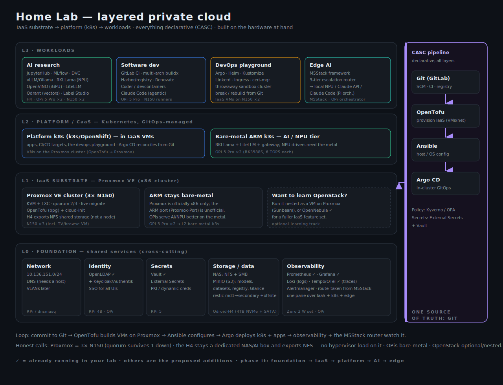

# Lab Design — a layered private cloud

> **Note:** This document reflects the original design proposal. The implemented solution uses bare-metal Ubuntu 24.04 + KVM/libvirt on n150-1/n150-2, not Proxmox VE. See ARCHITECTURE.md for the actual implementation.

How to make one heterogeneous fleet serve five goals at once: **AI research**,
**Configuration-as-Code (CASC)**, **software development**, a **DevOps playground**, and
**IaaS (OpenStack/OSP)**. The organizing idea is a **layered private cloud**: an IaaS
substrate at the bottom, a Kubernetes platform on top of it, workloads on top of that, and
**everything described in Git** so the whole thing is reproducible.

> Terms: **OSP** = OpenStack Platform. **CASC** = Configuration-as-Code (if you meant
> Containers-as-a-Service, that's the L2 Kubernetes layer — covered either way).

## The one decision that shapes everything: the IaaS layer

**Use Proxmox VE** — you were right that it's far lighter than OpenStack, with one correction
that actually improves the design: **Proxmox is officially x86-only.** Its forum states it
doesn't support ARM; what exists for the Orange Pi is an *unofficial* community port
("Proxmox-Port"/pimox). The port runs on the RK3588, but with caveats — only ARM64 guests run
efficiently (x86 guests fall back to slow QEMU emulation), and the RK3588's big.LITTLE layout
needs careful per-VM CPU affinity. So Proxmox belongs on your **x86 boxes, not the OPis**:

- **L1 IaaS = a 3-node Proxmox VE cluster from the three N150s** — the two lab boxes plus the
  living-room box, which runs its **TV/browse function as a VM on itself**. Three *identical*
  N150s give clean quorum and frictionless live migration (no CPU masking), KVM + LXC, and the
  `bpg/proxmox` OpenTofu provider + cloud-init for the CASC loop. Quorum needs 2 of 3, so the
  living-room node can reboot/sleep without taking the cluster down — the other two hold the
  majority. **The H4 stays *out* of the cluster** as the dedicated NAS/MinIO + AI box, serving
  NFS to the cluster as shared (migratable) VM storage — so it never carries hypervisor,
  quorum, or VM-I/O load on top of storage and AI.
- **The Orange Pi 5 Pros stay bare-metal** for AI/NPU + k3s — Proxmox being x86-only lines up
  with the fact that you don't want a hypervisor between you and the NPU anyway.
- **OpenStack becomes an optional learning track** — run it *nested as a VM on Proxmox* (Sunbeam)
  when you want the OpenStack experience, without it dominating the lab. OpenNebula
  (already installed) stays available if you want a fuller IaaS feature set than Proxmox.

This is lighter, officially supported, won't capsize the H4, and makes the split crisp:
**x86 = Proxmox IaaS, ARM = bare-metal AI.**

Because the H4 is no longer a hypervisor, it runs its NAS/MinIO **bare-metal** (Debian +
Samba/NFS, or TrueNAS) and simply **exports NFS to the cluster** for shared VM storage — which
is what lets guests live-migrate between the three N150s. Storage I/O and AI stay off the
hypervisors entirely; the cluster stays homogeneous and disposable.

## Node placement

## Node placement

Match each box to what it's actually good at. `✓` = already running.

| Node | Spec | Role in the design |
|------|------|--------------------|
| **Odroid-H4 Ultra** | x86 8C / **64 GB** / 4 TB NVMe + 8 TB RAID1 + ~5.45 TB RAID1 SATA | **Dedicated NAS/MinIO** + NFS shared storage for the cluster + heavy AI (JupyterHub) + backups. **Not a hypervisor node** — kept off quorum/HA and VM-I/O contention. |
| **Orange Pi 5 Pro ×2** | ARM 8C / 16 GB / **6 TOPS NPU** | **Bare-metal AI** (RKLLama) + the **Claude Code orchestrator** + GitLab✓; the "brain" tier. |
| **N150 ×3** | x86 4C / 16 GB each | **3-node Proxmox cluster** (homogeneous → clean live-migrate). Two lab boxes + the living-room box, which runs its **TV/browse VM** (iGPU passthrough) while still voting in quorum. Also OpenVINO iGPU inference. |
| **RPi 5** | ARM 4C / 8 GB | **Vault**✓ (secrets) + k8s agent. |
| **RPi 4B** | ARM 4C / 8 GB | **Pi-hole secondary DNS**✓ (192.168.1.116). |
| **RPi 3B ×2** | ARM 4C / 1 GB | #2 (wired) = **DNS (Pi-hole)** — printer offline; #1 ⚠ **power fault** → retire/RMA. |
| **Odroid-XU3** | ARM 8C / 2 GB ⚠ | CI build agent / light pods (flaky — verify). |
| **Orange Pi Zero 2W ×4** | H618 A53 4C / **4 GB** | **Standalone WiFi** (ClusterHAT failed) — a lightweight **k3s agent pool** (~16 C/16 GB) or single-service hosts; SD-only, keep stateless; no NPU. |
| **RPi Zero W ×3** | 1C / 512 MB / 32-bit | Standalone WiFi; ultra-light tasks only — retirement-grade. |
| **M5Stack** | ESP32 + AX630C NPU | **Edge AI** + the 3-tier escalation router front-end. |

The clean separation: **x86 = the cloud/IaaS substrate** (VMs, OpenStack, the nestable
platform), **ARM = bare-metal AI + infra services** (NPUs need the metal), **tiny boards =
edge/glue**.

## The living-room N150 as a cluster node

The cleanest use of the third N150: **move its TV/browse function into a VM and make the box a
full Proxmox node** running that VM. You get a proper 3-node cluster without putting any
hypervisor load on the H4 — which is exactly the right instinct.

Why this works (the quorum math): a 3-node Proxmox cluster needs **2 of 3 votes** for quorum.
So when the living-room node reboots, sleeps, or gets switched off, the other two still hold
the majority and the cluster keeps running — only that node's own VMs (including the TV VM,
which is *supposed* to go with it) pause. The earlier worry about a daily-desktop wrecking
quorum only bites a *2-node* cluster; at three nodes a flaky member is tolerable by design.

The details:
- **Passthrough for the TV/browse VM (cores + disk + GPU):**
  - *CPU* — set `cpu: host` for native features/speed and pin vCPUs with `affinity`. The N150
    is 4C/4T with no HT, so give the VM 2–3 cores and leave ≥1 for the host.
  - *Disk* — pass a *whole physical disk* (`qm set <vmid> -scsi1 /dev/disk/by-id/...`) if the
    box has a spare slot; controller (VFIO) passthrough only works with a non-boot controller;
    otherwise a raw/zvol virtual disk is the fuss-free choice.
  - *GPU* — **full iGPU passthrough (GVT-d)**: node runs headless, the VM owns the GPU for
    decode + desktop. SR-IOV (`i915-sriov-dkms`) only if you want to share the iGPU with other
    guests (more setup, breaks on kernel updates).
  - *Prereqs* — VT-d/IOMMU on in BIOS (confirm it's exposed), `intel_iommu=on`, the iGPU in its
    own IOMMU group, `vfio-pci` bound; set up SSH/RDP first since the node goes headless.
  - *Tradeoff* — GPU/disk passthrough **node-locks the VM** (no live migration); fine for an
    HTPC. The node still votes in quorum and can still host other migratable VMs alongside.
- **The one rule: don't have two nodes down at once.** That's the only state that loses
  quorum. If the living-room box is *frequently powered fully off* (not just rebooted), you're
  effectively a 2-node cluster during those windows — so either keep it powered (it idles at
  ~6–10 W) or add a tiny **QDevice** vote (on an always-on Zero 2W — *not* the faulty 3B #1) as a tie-breaker.
- **Capacity division stays clean.** The cluster totals ~12 cores / ~48 GB (3× N150) minus the
  TV VM — fine for the platform k8s + dev/sandbox VMs. Keep memory-heavy AI (JupyterHub, large
  models) on the **H4 natively** (its 64 GB), not as cluster VMs. That's the right split: the
  H4's RAM and disks go to storage + AI, the N150s do elastic compute.

## Software by goal

| Goal | Stack |
|------|-------|
| **AI research** | JupyterHub (H4) · MLflow (experiments) · DVC (data) · RKLLama (OPi NPU) · OpenVINO (iGPU) · vLLM/Ollama (H4 CPU) · **LiteLLM gateway** + the **M5Stack escalation router** · Qdrant/Chroma (vectors) · Label Studio · MinIO for datasets/models |
| **CASC** | **Git (GitLab✓)** as source of truth · **OpenTofu** (provision the IaaS) · **Ansible** (host config) · **Argo CD** (in-cluster GitOps) · Kyverno/OPA (policy) · External Secrets + Vault✓ |
| **Software dev** | GitLab✓ (SCM/CI/registry) · multi-arch `buildx` (your fleet is x86+arm64 — great for testing both) · Harbor or GitLab registry · Renovate · Coder/devcontainers · **Claude Code** (agentic) |
| **DevOps playground** | Argo · Helm · Kustomize · Linkerd (light mesh) · ingress-nginx/Traefik · cert-manager · a **throwaway sandbox cluster** you rebuild from Git · the full Terraform→Ansible→Argo loop |
| **IaaS** | **Proxmox VE** cluster (KVM + LXC) on x86 · OpenTofu `bpg/proxmox` + cloud-init templates · NFS/ZFS shared storage · *(optional: OpenStack via Sunbeam nested for learning; OpenNebula✓ for a fuller IaaS)* |
| **Observability (shared)** | Prometheus✓ · Grafana✓ · Loki (logs) · Tempo + OpenTelemetry✓ (traces) · Alertmanager · plus `route_taken` from the M5Stack router |

## Provisioning the small stuff (no MAAS)

MAAS is built to provision bare-metal **servers** — PXE netboot, hardware commissioning, and
power control over IPMI/BMC. It can't touch a true microcontroller and is an awkward, heavy fit
for WiFi SD-card SBCs that have no Ethernet, no netboot, and no BMC. So skip it and match the
tool to the device — which collapses to **two patterns**:

| Device | How it's provisioned |
|--------|----------------------|
| **Microcontrollers** (M5Stack / ESP32-S3) | No OS — flash firmware with **PlatformIO** (or Arduino-CLI / `esptool`); **ArduinoOTA** for wireless reflash; **ESPHome** if you want declarative YAML firmware. The M5Stack framework already does live config via its dashboard/REST + SD. |
| **SD-card SBCs** (OPi Zero 2W, RPi Zero W, RPi 3B) | Image-based, not netboot. Bake first-boot config into the image — **rpi-imager** (hostname/SSH key/user/WiFi) or **cloud-init** on Ubuntu/Armbian — so the board boots **SSH-ready**, then **Ansible** configures it. |
| **VMs** (Proxmox) | Already solved — **cloud-init templates via the OpenTofu `bpg/proxmox` module**. |
| **x86 boxes** (if you ever want netboot) | **netboot.xyz** — a tiny PXE boot menu. Still not MAAS. |

So the whole fleet reduces to: *cloud-init / first-boot image → Ansible* for anything with an
OS, and *PlatformIO / OTA* for anything without. No provisioning server, and it reuses the
Ansible you already have. Bonus: it takes **MaaS off OPi 5 Pro #2**, one of the five services
that made that board the consolidation hot-spot.

> For the actual click-by-click bring-up, see **[STANDUP.md](STANDUP.md)**.

## How the layers connect

The payoff is one reproducible loop that exercises every goal:

1. **Commit** infra to Git (GitLab).
2. **OpenTofu** reads it and provisions VMs + networks on the **IaaS** (OpenStack/OpenNebula).
3. **Ansible** configures those hosts.
4. **Argo CD** deploys the **platform k8s** and the apps into it from the same Git.
5. **Observability** watches the result; the **M5Stack router** and **LiteLLM gateway** give
   you the AI surface across it all.

Two Kubernetes footprints, on purpose: a **platform k8s in IaaS VMs** (the cloud-native
devops loop — provision, nest, GitOps) and a **bare-metal ARM k3s** for AI (the NPUs need
direct device access, which is painful through virtualization). The k3s + Argo repo you
already have is a valid *fast path* for the platform layer — run it bare-metal now, and grow
into the IaaS-VM version as the cloud layer comes up.

Shared services (L0) are deliberately cross-cutting: one **identity** (OpenLDAP + an SSO like
Keycloak/Authentik in front of every UI), one **secrets** authority (Vault, surfaced into k8s
via External Secrets), one **storage** plane (NAS for files + **MinIO S3** for models,
datasets, the registry, and OpenStack Glance images), one **observability** pane over IaaS +
k8s + edge.

## Honest constraints

- **Proxmox is x86-only.** Keep it on the H4 + N150s; don't put it on the OPis (the ARM port
  is unofficial and x86 guests there emulate slowly). OpenStack, if you want it, is a nested
  learning VM — don't expect a smooth bare-metal multi-node OpenStack on this fleet.
- **Ceph is probably too heavy** (wants 3+ nodes and RAM). Use local/LVM storage + MinIO for
  S3 rather than a distributed block store.
- **Nesting k8s in VMs costs overhead** on small nodes — worth it for the cloud loop, but keep
  AI on bare metal.
- **Single points of failure everywhere** (one NAS, one control node). This is a lab, not HA —
  lean on Git + restic backups for recovery, not redundancy.
- **Power, heat, noise** are real with this many boards. Consolidate the always-on core (H4 +
  2 OPi + 1–2 RPi) and power the rest on demand.
- **Credentials need rotating** — a prerequisite, not an afterthought. (DNS is now resolved:
  Pi-hole on the wired RPi 3B #2 + a Zero 2W secondary — `make dns`.)

## A phased rollout

1. **Foundation (L0).** DNS via `make dns` (Pi-hole on the wired 3B #2 + Zero 2W secondary); rotate credentials; stand up MinIO on the H4;
   confirm Vault/OpenLDAP; get Prometheus/Grafana/Loki/Tempo into one Grafana.
2. **IaaS (L1).** Stand up the 3-node Proxmox cluster (N150 ×3): NFS shared storage exported
   from the H4, a cloud-init VM template, and the `bpg/proxmox` OpenTofu provider. Move the
   living-room box's function into a VM on its own node. (Later, optional: a nested Sunbeam
   OpenStack VM for learning.)
3. **Platform (L2).** OpenTofu → VMs → Ansible → a k3s/OpenShift cluster → Argo CD. This *is*
   the devops playground. (Or run the existing bare-metal k3s now.)
4. **AI (L3).** RKLLama on the OPis, OpenVINO on the Intel iGPUs, the LiteLLM gateway, the
   m5stack-adapter, JupyterHub + MLflow + a vector DB.
5. **Edge.** Wire the M5Stack escalation router to the gateway; `route_taken` into Grafana.

Each phase is independently useful, and each is described in Git so you can tear it down and
rebuild it — which is the whole point.
